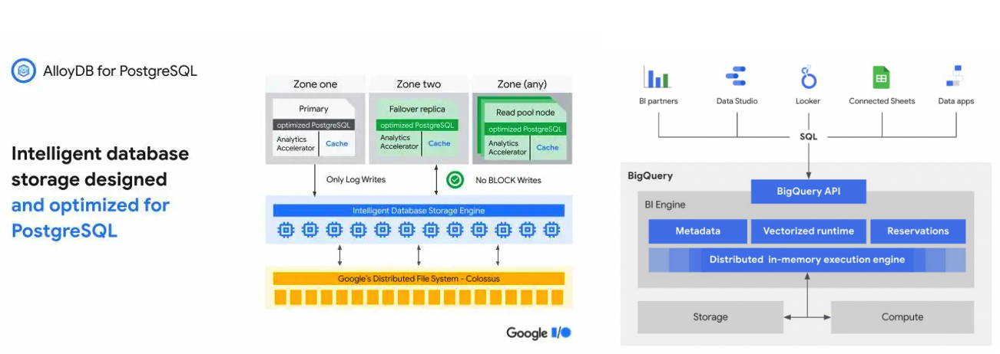

## 重要更新

**Google云服务发布完全兼容PostgreSQL的云原生数据库AlloyDB** ：AlloyDB是Google在云原生数据库领域的重要探索，其基于Google分布式文件系统，实现了存储计算分离的架构，提供一写多读的服务能力。通过引入向量化的列加速器及实现了in-memory column store，AlloyDB可以支持分析负载。据官方宣传，事务性能是AWS Aurora PostgreSQL的2倍，为原生PostgreSQL的4倍。同时，分析性能为原生PostgreSQL的100倍。从各种消息猜测GCP发力AlloyDB的主要目标是为Oracle存量市场客户提供迁移解决方案。[其数据库迁移产品DMS也刚刚发布了Oracle-to-PostgreSQL的结构迁移及数据复制能力] 。

**GCP BigQuery BI Engine正式GA，有效加速大屏或报表等应用**：BI Engine是一种架设在BigQuery之上的快速的内存分析服务，可为连接到 BigQuery 的仪表板和报告加速并提供亚秒级的查询性能。BI Engine具备智能弹性能力，其会根据业务访问情况自动优化内存大小。

**TiDB Cloud 正式GA，重点服务中国出海或海外企业客户**： PingCAP公司于5月11日宣布TiDB Cloud正式商用。TiDB Cloud围绕TiDB数据库提供了全托管的DBaaS（Database-as-a-Service）服务。TiDB Cloud提供了实例创建管理、备份恢复、SQL审计及监控报警等能力，基本上屏蔽了实例部署运维的复杂度，几分钟即可拉起整个集群，使用还比较简单。当前TiDB Cloud支持AWS、GCP两家云厂商，覆盖日本东京、新加坡、美国[弗吉尼亚]、美国[俄勒冈] 及印度[孟买]五个区域。TiDB Cloud提供了开发版本、概念测试版、标准版、企业版及旗舰版等多个版本，其中开发版本可免费测试1年，概念测试版提供14天免费测试周期，其他均为付费版本。产品按照计算、存储、流量及备份存储空间按需付费。

**MySQL 8.0.29正式GA**：  主要新增功能包括InnoDB表的ALTER TABLE....DROP column支持`ALGORITHM=INSTANT`，实现不锁表在线变更。同时，在任意位置添加Column均支持不锁表在线变更。这个版本开始支持binlog文件的自动purge。

**AWS RDS PG支持只读级联副本，最高可将读容量提高30倍**：AWS RDS PG宣布在PostgreSQL 14.1版本开始支持级联只读同步，最多可以支持三层级联，每个节点可挂载5个只读实例，单个源实例最多可以支持155个只读副本。相较于之前的版本，最高提升30倍的读吞吐。基于AWS的只读级联能力，可以解决非级联情况下，只读副本对主实例的性能消耗，同时极大得扩展了实例的读吞吐能力。AWS是当前唯一拥有此特性的云厂商，对于读流量压力比较大的客户确实是一个福音。

## 更新详情

* [AWS] ElastiCache 上线新版控制台，重新优化了实例创建体验。
* [AWS] RDS SQLServer在Express、Web、Standard和Enterprise版本上，支持SQLServer 2016 SP3、2017 CU27、2019 CU15，修复性能和安全问题。
* [AWS] RDS For PostgreSQL 支持级联只读副本，最高可将读容量提高30倍。
* [AWS] RDS 性能详情支持按照自定义查询时间范围进行性能数据的查询。
* [AWS] RDS ON AWS outposts现在支持手动及自动存储扩缩，用户设置“Enable storage autoscaling”并设置存储上限，RDS即会根据业务情况自动扩缩存储。
* [AWS] RDS已支持互联网协议版本6 IPv6。存量客户迁移到IPv6后 ，可以同时保持IPv4、IPv6。
* [AZURE] SQL Database HyperScale 提供99.99%的服务SLA。  [参考](https://azure.microsoft.com/zh-cn/support/legal/sla/azure-sql-database/v1_7/)
* [GCP] 正式发布完全兼容PostgreSQL的云原生数据库AlloyDB。[参考](https://cloud.google.com/blog/products/databases/introducing-alloydb-for-postgresql)
* [GCP] BigQuery支持远程函数，用户可基于GCP cloud function定义外部函数，并在BigQuery中调用使用。
* [GCP] BigQuery BI Engine正式GA,在不牺牲数据时效性的情况下，有效加速大屏及报表等业务负载。
* [阿里云] 阿里云RDS MySQL发布企业级控制台，支持批量运维能力。
* [阿里云] 阿里云云数据库Redis支持实例回收站，适用于停机后希望保留数据的场景。
* [腾讯云] 腾讯云DTS增强能力，SQLServer迁移支持云联网，支持MongoDB多账号认证，同时支持付费实例销毁后恢复。
