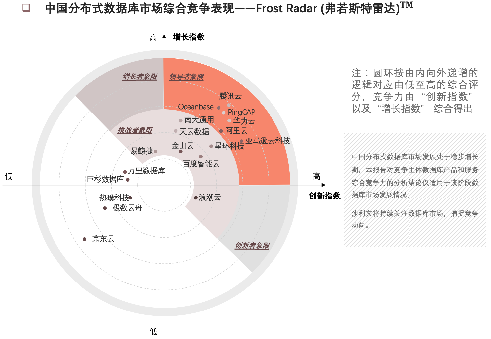

### 重要更新

SQL Server 2022基于Linux版本（公测版）也已经发布了：[参考](https://techcommunity.microsoft.com/t5/sql-server-blog/sql-server-2022-public-preview-is-now-available-on-linux/ba-p/3460686)。在过去的几年，微软在更加彻底的拥抱云计算、拥抱开源、拥抱Linux。延伸阅读：[SQL Server 2022公测发布：全面支持云服务的数据库](https://cloud-database-tech.github.io/sql-server-2022-whats-new.html) 

PolarDB-X发布了5.4.14版，新增数据Locality、数据热点诊断、并行DML优化、和AUTO_INCREMENT兼容性、冷热数据存储分离、Flashback Query等功能：[参考](https://help.aliyun.com/document_detail/217941.html) ；对应的开源版本也发布了对应的2.1版本：[参考](https://developer.aliyun.com/topic/polardbx_release?spm=a2c6h.12873639.article-detail.5.1376640dWTfdCB) 

**另一个有意思的事情说一下**：PingCAP在上周末发了一篇关于腾讯PCG（平台与内容事业群）使用TiDB的实践经验介绍的文章，今早看到已经删除了，文章内容本来是不错的，但是，文章中直接提到TDSQL的一些缺点以及问题，作为选择TiDB的佐证之一，所以外人看来就是，腾讯自己的数据库不行，而因此选择了TiDB，并为TiDB站台......。看到这个文章，第一感受是，腾讯内部是比较开放的，不同的团队/事业部有比较强的架构选择权。再一想，也看出，大概腾讯内部也比较“拧巴”，多个数据库技术团队有着比较大的竞争（也可能是一种良性的竞争）。在很久以前，TiDB是在腾讯云上线过，且是以接近一方的HTAP产品上线的，后来不确定由于什么原因最终下线，也看到腾讯和TiDB的合作一直也比较“坎坷”，PingCAP发这篇文章的时候，应该意识到，是很容易出问题的，具体的文章，八卦的同学，可以通过互联网搜索查看，应该还有一些“快照”。

AWS RDS和GCP MySQL支持MySQL小版本8.0.29。不是什么大的事情，不过可以看到，AWS和Google云的托管型产品对于开源MySQL的支持，基本上保持1~2个月的跟进速度，MySQL官方8.0.29 GA时间为4月26日，AWS RDS和GCP都已经支持该小版本。

沙利文联合头豹研究院发布了《2021年中国分布式数据库市场报告》，在中国分布式数据库市场综合竞争表现——Frost Radar (弗若斯特雷达)TM中，腾讯云、OceanBase、PingCAP、华为云、Amazon、阿里云、南大通用、星环科技、天云数据、百度智能云、金山云等在领导者象限：[参考](https://www.leiphone.com/category/industrynews/VjLITrRJWUPGwRoj.html)。

### 更新详情

* [阿里云] RDS PostgreSQL支持空间自动扩容：[参考](https://help.aliyun.com/document_detail/432496.htm?spm=a2c4g.11186623.0.0.4566c649lnrcG3#task-2220199) 
* [阿里云] RDS PostgreSQL支持数据库代理：[参考](https://help.aliyun.com/document_detail/418272.html?spm=5176.12418109.pc-particulars-shares2.1.2e2929b3MB6R2w) 
* [阿里云] Redis云盘版现已经支持Redis 7.0：[参考](https://help.aliyun.com/document_detail/432042.html?spm=5176.12418109.pc-particulars-shares2.1.470a29b3qiqlv5)  
* [阿里云] PolarDB支持用户创建和使用Federated引擎表
* [阿里云] PolarDB-X 支持了全局唯一、连续、单调递增的New Sequence：[参考](https://help.aliyun.com/document_detail/316611.htm?spm=a2c4g.11186623.0.0.685f5b78j1Gybi#section-lko-don-4h9)
* [阿里云] 阿里云数据库宣布2022年团队共有15篇论文被数据库三大国际顶级会议SIGMOD、VLDB、ICDE收录，其中8篇来自于阿里云和达摩院的独立研究，7篇来自于阿里云与北京大学、浙江大学、香港科技大学等高校紧密合作的联合研究：[参考](https://www.sohu.com/a/547855028_114930) 
* [阿里云] PolarDB-X开源版本发布2.1版本，支持 X-Paxos、自动分区、OSS 冷热数据分离等功能：[参考](https://developer.aliyun.com/topic/polardbx_release?spm=a2c6h.12873639.article-detail.5.1376640dWTfdCB)
* [OceanBase] 推出历史库集群版解决客户历史数据的读取和更新问题。通过大容量机械盘的低成本存储方案，有效的降低客户历史数据的存储成本。同时兼顾客户对于历史库的查询功能：[参考](https://help.aliyun.com/document_detail/432617.htm?spm=a2c4g.11186623.0.0.784471319KIYnW#topic-2216347)
* [腾讯云] TDSQL-C MySQL 版支持查询和下载慢日志明细，支持下载 csv 和原生格式：[参考](https://cloud.tencent.com/document/product/1003/74909) 
* [腾讯云] Redis服务全新升级，发布高性能版本，单节点可提供50W+吞吐，性能是原生Redis的4倍，同时推出全球复制功能：[参考](https://mp.weixin.qq.com/s/P_ntuOKNAxZl8VGlD96C1w) 
* [AWS] RDS MySQL支持小版本5.7.38、8.0.29：[参考](https://docs.aws.amazon.com/AmazonRDS/latest/UserGuide/CHAP_MySQL.html#MySQL.Concepts.VersionMgmt)。AWS RDS MySQL一直保持了与官方开源版本1个月左右的进度，即官方GA之后，AWS一个月就会完成响应的版本发布，例如5.7.38版本GA的时间是04月26：[参考](https://dev.mysql.com/doc/relnotes/mysql/5.7/en/news-5-7-38.html)。
* [AWS] NoSQL Workbench支持了DynamoDB的CreateTable、UpdateTable和DeleteTable等操作：[参考](https://aws.amazon.com/about-aws/whats-new/2022/06/amazon-nosql-workbench-dynamodb-createtable-updatetable-deletetable-operations/?nc1=h_ls)
* [AWS] Amazon EMR Serverless正式GA：[参考](https://aws.amazon.com/about-aws/whats-new/2022/06/amazon-emr-serverless-generally-available/?nc1=h_ls)
* [AWS] RDS支持将Event信息投递到加密的Amazon SNS topics：[参考](https://docs.aws.amazon.com/AmazonRDS/latest/UserGuide/USER_Events.Subscribing.html)
* [GCP] Cloud SQL MySQL支持小版本8.0.29：[参考](https://cloud.google.com/sql/docs/mysql/upgrade-minor-db-version)。Oracle MySQL官方改版为最新GA版本，发布时间为4月26日：[参考](https://dev.mysql.com/doc/relnotes/mysql/8.0/en/) 。
* [GCP] Spanner提供的Change streams功能正式GA：[参考](https://cloud.google.com/blog/products/spanner/change-streams-for-cloud-spanner-now-generally-available)。
* [GCP] BigQuery支持列级别的数据保护（priview）：[参考](https://cloud.google.com/bigquery/docs/column-data-masking-intro)
* [AWS] ElastiCache for Memcached开始支持TLS传输，实现传输过程加密：[参考](https://aws.amazon.com/about-aws/whats-new/2022/05/amazon-elasticache-memcached-supports-encryption-data-transit/)。 
* [Azure] SQL Server 2022公测版本基于Linux版本也正式发布：[参考](https://techcommunity.microsoft.com/t5/sql-server-blog/sql-server-2022-public-preview-is-now-available-on-linux/ba-p/3460686)。延伸阅读：[SQL Server 2022公测发布：全面支持云服务的数据库](https://cloud-database-tech.github.io/sql-server-2022-whats-new.html) 
* [其他] Percona推出Percona Platform，融合了之前的PMM以及DBaaS相关产品，主要支持MySQL、PostgreSQL、MongoDB ：[参考](https://www.percona.com/software/percona-platform)
* [其他] 有超过360万的MySQL暴露（端口开放且返回了服务器基本信息，并不是登录成功）在互联网上：[参考](https://www.shadowserver.org/what-we-do/network-reporting/accessible-mysql-server-report/)
* [其他] 沙利文联合头豹研究院发布了《2021年中国分布式数据库市场报告》，其中中国分布式数据库市场综合竞争表现——Frost Radar (弗若斯特雷达)TM中，腾讯云、OceanBase、PingCAP、华为云、Amazon、阿里云、南大通用、星环科技、天云数据、百度智能云、金山云等在领导者象限：[参考](https://www.leiphone.com/category/industrynews/VjLITrRJWUPGwRoj.html)
* 云南红塔银行新一代核心系统使用OceanBase：[参考](https://mp.weixin.qq.com/s/-IPhtm3SHKjqEsPXuMaTaA)

### 其他

* [AWS] 发布新一代芯片Graviton3，是面向计算密集型场景设计，声称相比上一代性价比提升为40%：[参考](https://aws.amazon.com/ec2/graviton/)

