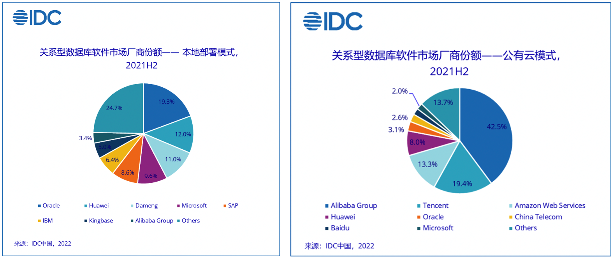
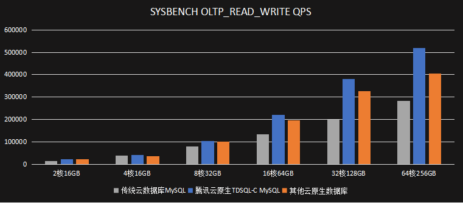

### 重要更新

**IDC中国数据库份额：公共云阿里腾讯领跑、专有云华为和达梦异军突起**：IDC发布《2021年下半年中国关系型数据库软件市场跟踪报告》，2021年下半年中国市场规模15.8亿美元，同比增长34.9%。公共云模式前五名分别为：阿里云、腾讯、AWS、华为和Oracle等；本地部署模式前五为：Oracle、华为、达梦、微软、SAP。公共云阿里云一枝独秀、腾讯云奋起直追；专有云市场则变化很大，华为和达梦异军突起：[参考](https://finance.sina.com.cn/stock/hkstock/ggscyd/2022-06-21/doc-imizmscu7956271.shtml)。

**腾讯云TDSQL-C重磅升级，号称性能吊打橙色友商**：腾讯云数据库TDSQL-C重磅升级，包括基于英特尔® 傲腾™持久内存的二级缓存、全链路RDMA网络、7*24持续无锁备份等核心功能。号称“在全缓存场景、大数据集场景中，新版TDSQL-C 性能全面超越业内其他云原生数据库产品”（下图的橙色的“其他云原生数据库”应该就是代指PolarDB吧），[参考](https://mp.weixin.qq.com/s/dciHvuzFXinBQlO__Zw3kw)：

**阿里云再获MongoDB全球用户大会奖项**：阿里云荣膺MongoDB“年度新兴市场最佳云合作伙伴奖”！双方持续高质量合作MongoDB 2022年度盛典全球用户大会（MongoDBWorld），授予阿里云“新兴市场最佳云合作伙伴”奖项。阿里云一直在与MongoDB深度合作，在全球云厂商中，也只有阿里云提供*最新*版本MongoDB一方产品。

**TiDB上线心选商城，Nebula Graph获计算巢认证**：TiDB上线阿里云心选商城：[参考1](https://pingcap.com/zh/events/tidb-on-aliyun/?utm_source=wechat&utm_medium=social&utm_campaign=wechat-pr) [参考2](https://market.aliyun.com/products/56024006/cmgj00054143.html?spm=5176.730005.result.52.21434e90Oq5dTV&innerSource=search#sku=yuncode4814300001)。这是从阿里云生态同学的朋友圈看到的消息，在阿里云云市场的首页Banner也看到有宣传。另一方面，大概是阿里云官方产品PolarDB-X和TiDB是直接竞争产品，阿里云数据库团队对此则保持了安静，没有任何声音。不过，话说最近，PolarDB-X连续发布新版本、训练营和对外宣讲技术，猜测也可能是对此事件的一个"应激"。不过，最近听说宣讲PolarDB-X技术的部分同学，好像已经提了离职，应该不是去TiDB。

国产开源分布式图数据库 Nebula Graph 宣布正式通过阿里云“计算巢合作伙伴”认证，成为阿里云计算巢上第一家图数据库供应商：[参考](https://mp.weixin.qq.com/s?__biz=MzI1ODQyMDg3Mg==&mid=2247492244&idx=1&sn=c98140c23613e0999011379a1d4899ea&scene=21#wechat_redirect)。

**TiDB入选Gartner Peer Insights评价象限，中国唯一**：TiDB入选Gartner云数据库市场领域Peer Insights™报告，是在该评价象限图中，中国唯一的数据库厂商，还是非常不容易的。特意去Gartner官网确认了一下，没有找到公开的报告，不过所有的用户评价都是公开的，于是仔细看了一下过去12个月38个客户对TiDB的评价，怎么说呢，评价"甜的有点发齁"，这应该是不太现实的，不过因为Gartner审核比较严格，反馈应该都是来自相关客户的注册账号，根据以前做Gartner魔力象限的经验来看，一定是要厂商和客户"好好合作"共同完成这个反馈提交的。感兴趣的可以自己去看相关评价：[参考1](https://pingcap.com/zh/about-us/company-news-detail/pingcap-recognized-in-2022-gartner-peer-insights) [参考2](https://www.gartner.com/reviews/market/cloud-database-management-systems/vendor/pingcap/product/tidb) ；

**腾讯宣布“经过多年磨砺与创新，内部海量自研业务已实现全面上云”**：[参考1](https://mp.weixin.qq.com/s/drdTpuq-tkWw_YT6eGfIbA) [参考2](https://mp.weixin.qq.com/s/vBX2V6JTr3_Dt09Hp0o_8g)。真的全面上云了吗？答案是非常确定的。相信，腾讯云在客户侧一定会经常被问到：“你让我们上腾讯云，你们自己内部的业务上云了吗”。在这之前，这个问题是很难回答的，不过，在这之后，估计也不是很好回答。全面上云前两年阿里云也宣传过，从这次腾讯的宣传的感觉来看，可能是把阿里云的PR和市场团队挖过去了。

**理想发布旗舰车型L9，OceanBase为其底层基础设施**：在理想发布了 新的旗舰车型 L9时，OceanBase也对外宣布理想汽车的"MES生产制造系统、WMS仓储管理系统"等使用了OceanBase作为其数据存储，通过内置的自动切换能力，帮助提升系统的稳定性。借着客户业务新车发布，跨界进行传播，还是非常不错的。建议OB趁热打铁，邀请理想的技术同学深度的介绍一下实际的业务架构和使用情况，会对其他客户有更好的影响力。

**Snowflake发布新的HTAP表类型**：分析领域，真的是百花齐放百家争鸣的情况，如下动态可以一起看：

- Snowflake发布新的表类型Hybrid Tables，使用新的存储引擎UniStore，支持HATP查询：[参考1](https://www.snowflake.com/blog/introducing-unistore/) 、[参考2](https://mp.weixin.qq.com/s/UDIaEhUszwiJ37fSTbDDUg)、[参考3](https://mp.weixin.qq.com/s/5JP3fi1f7bH5fhEtiwCCnw)。
- 九章云极（注：不是玖章算术）发布开源HTAP数据库DingoDB，使用Apache Calcite、RocksDB，支持点差和多维分析等能力：[参考](https://mp.weixin.qq.com/s/Y3EIbofCVH3IsDCFDPZ6rQ)  
- 石原子发布开源MySQL兼容HTAP数据库StoneDB，称6月30日发布源码：[参考](https://www.stoneatom.com/) 
- 极数云舟正式公开发布首款Data Fabric产品DTark：[参考](https://mp.weixin.qq.com/s?__biz=MzIyNTg0Njg4NQ==&mid=2247485142&idx=1&sn=6e9e1baa1c505528463add8c4f711927&scene=21#wechat_redirect)  
- 拓数派（以下简称“OpenPie”）对外宣布完成新一轮数亿元战略融资，“秉承「最终实现大数据愿景」的产品理念，重新打造PostgreSQL 12.X实现存算分离的同时，也创造了全新eMPP(elastic Massive Parallel Processing，弹性大规模并行计算)分布式技术，构建以云原生、分析型分布式数据库为内核的全新数据计算平台：[参考](https://mp.weixin.qq.com/s?__biz=MzkxMzM4MDQ1Ng==&mid=2247483760&idx=1&sn=5be0e1aa2edf0cd8c459285df59ffec8&scene=21#wechat_redirect)

**DataStax获1.15亿美元投资，开始关注中国市场**：DataStax获得1.15亿美元投资，由高盛资产管理公司领投，该公司主要产品是Astra DB（基于Apache Cassandra的多云托管服务，类似于MongoDB的Atlas）。Cassandra也是最早的NoSQL之一，但是流行度一直没有那么高，尤其是在中国，注意到，DataStax现在也开始在中国市场做一些推广了：[参考](https://mp.weixin.qq.com/s/anlYceYTmsVVDbnI3qvM5A)。

**Amazon Aurora开始支持PostgreSQL 14**：Aurora开始支持PostgreSQL 14，社区14.0版本是21年9月30日发布。当前几个几个主要的云原生数据库PostgreSQL版本支持的情况如下：PolarDB兼容PostgreSQL 11（[参考](https://help.aliyun.com/product/172538.html)）；TDSQL-C兼容PostgreSQL 10（[参考](https://cloud.tencent.com/document/product/1556/68596)）；AlloyDB兼容PostgreSQL 14；openGauss应该是使用的PostgreSQL 9.4的版本（[参考](https://www.modb.pro/db/101753)）。这里可以看到：

- PostgreSQL最近几年是非常受欢迎的，无论是对于大厂商还是小厂商；
- 国外云厂商对于支持PostgreSQL支持力度更大、更坚决；
- PostgreSQL因为其流行度，加之其协议的宽松，让厂商在投入时更加坚决

### 更新详情 

* [阿里云] RDS PG发布内核小版本，兼容社区14.4，Ganos引擎升级到4.7版本，同时修复了部分Bug：[参考](https://help.aliyun.com/document_detail/126002.htm?spm=a2c4g.11186623.0.0.4566586dmj5auv#concept-1236825)
* [阿里云] RDS PG支持了大版本升级过程中的空间缩容：[参考](https://help.aliyun.com/document_detail/203309.htm?spm=a2c4g.11186623.0.0.45666e526zEqeg#task-2039768)
* [阿里云] RDS PG基础版实例变更存储类型：[参考](https://help.aliyun.com/document_detail/96750.htm?spm=a2c4g.11186623.0.0.4566586dVQp0f8#concept-efl-pln-wdb)
* [阿里云] RDS MySQL内核升级了小版本20220523修复了部分bug：[参考](https://help.aliyun.com/document_detail/96060.htm?spm=a2c4g.11186623.0.0.45666167io4vYk#concept-kry-21l-n2b)
* [阿里云] RDS MySQL新增SSL证书到期通知并自动更新功能：[参考](https://help.aliyun.com/document_detail/96120.htm?spm=a2c4g.11186623.0.0.45663730pZesdu#concept-ack-rv4-ydb)
* [腾讯云] 云数据库 SQL Server 支持SSIS数据集成服务：[参考](https://cloud.tencent.com/document/product/238/75223)
* [腾讯云] 数据传输 DTS在同步时默认采用无锁方式，同步过程中对源库不加全局锁
* [火山云] 数据传输 DTS公测支持了PostgreSQL、MongoDB、Redis的迁移：[参考](https://www.volcengine.com/docs/6390/70697)
* [AWS] Aurora PostgreSQL支持不停机小版本升级，升级过程用户连接依旧保持：[参考](https://aws.amazon.com/about-aws/whats-new/2022/06/amazon-aurora-postgresql-compatible-edition-supports-zero-downtime-patching/)
* [AWS] Aurora PostgreSQL支持LO模块，帮助用户更好的管理大对象：[参考](https://aws.amazon.com/about-aws/whats-new/2022/06/amazon-aurora-postgresql-supports-lo-module/)
* [AWS] Aurora PostgreSQL支持小版本13.7, 12.11, 11.16, and 10.21：[参考](https://aws.amazon.com/about-aws/whats-new/2022/06/amazon-aurora-supports-postgresql-versions-extensions/)。在PostgreSQL官方推出小版本后一个月，AWS将会在其托管平台上发布对应最新的小版本，例如13.7版本官方发布时间为5月12日：[参考](https://www.postgresql.org/docs/13/release-13-7.html)。
* [AWS] RDS for Oracle开始支持18c、12c(12.2)版本：[参考](https://docs.aws.amazon.com/AmazonRDS/latest/UserGuide/custom-cev.html)
* [AWS] 大型机上云迁移（Mainframe Modernization）服务正式GA：[参考](https://aws.amazon.com/about-aws/whats-new/2022/06/aws-mainframe-modernization-generally-available/) [参考](https://aws.amazon.com/mainframe-modernization/)
* [AWS] EC2推出新的r6id实例，最大规格为128vCPU、1024GB内存、4*1.9TB NVMe SSD：[参考](https://aws.amazon.com/ec2/instance-types/r6i/) 
* Aurora Serverless v1支持从MySQL 5.6到5.7的原地升级 [参考](https://aws.amazon.com/cn/about-aws/whats-new/2022/06/amazon-aurora-serverless-v1-in-place-upgrade-mysql-5-6-5-7/) 
* [Azure] SQL Hyperscale支持跨区域的数据复制与自动切换能力：[参考](https://techcommunity.microsoft.com/t5/azure-sql-blog/announcing-general-availability-ga-of-active-geo-replication-amp/ba-p/3466710)
* [Azure] Cosmos DB serverless最大存储支从50GB持提升至1TB空间：[参考](https://azure.microsoft.com/en-us/updates/public-preview-azure-cosmos-db-serverless-container-storage-limit-increase-to-1tb/)
* [Azure] Cosmos DB API for MongoDB最大存储从2MB提升至16MB（与MongoDB本身[限制](https://www.mongodb.com/docs/v5.0/core/document/#document-limitations)相同）：[参考](https://azure.microsoft.com/en-us/updates/public-preview-16mb-limit-per-document-in-api-for-mongodb/)
* [Azure] SQL Managed Instance提供的Link特性支持将2016版本实例同步都Azure云端：[参考](https://azure.microsoft.com/en-us/updates/public-preview-link-feature-in-azure-sql-mi-for-sql-server-2016/)
* [Azure] Advisor开始支持托管MySQL（FS版本）：[参考](https://azure.microsoft.com/en-us/updates/general-availability-azure-advisor-support-for-azure-database-for-mysql-flexible-server/)
* [Azure] Azure Data Studio开始支持MongoDB扩展，可以支持常见的管理以及CRUD操作：[参考](https://azure.microsoft.com/en-us/updates/public-preview-azure-data-studio-mongodb-extension-for-azure-cosmos-db/) 
* [GCP] 托管PostgreSQL新增支持了如下扩展：pg\_bigm、refint、decoderbufs、pg\_wait\_sample等：[参考](https://cloud.google.com/sql/docs/postgres/extensions#miscellaneous-extensions)
* [GCP] 托管数据库（MySQL/PG/SQL Server）开始支持更快速的实例变更能力，使得连接不可用时间小于60秒：[参考](https://cloud.google.com/sql/docs/mysql/instance-settings#impact)
* [GCP] Memorystore for Redis开始支持用户密钥管理功能（公测）： [参考](https://cloud.google.com/memorystore/docs/redis/cmek) 

### 其他

腾讯宣布“经过多年磨砺与创新，内部海量自研业务已实现全面上云”：[参考1](https://mp.weixin.qq.com/s/drdTpuq-tkWw_YT6eGfIbA) [参考2](https://mp.weixin.qq.com/s/vBX2V6JTr3_Dt09Hp0o_8g)。真的全面上云了吗？答案是非常确定的。相信，腾讯云在客户侧一定会经常被问到：“你让我们上腾讯云，你们自己内部的业务上云了吗”。在这之前，这个问题是很难回答的，不过，在这之后，估计也不是很好回答。全面上云前两年阿里云也宣传过，从这次腾讯的宣传的感觉来看，可能是把阿里云的PR和市场团队挖过去了。
