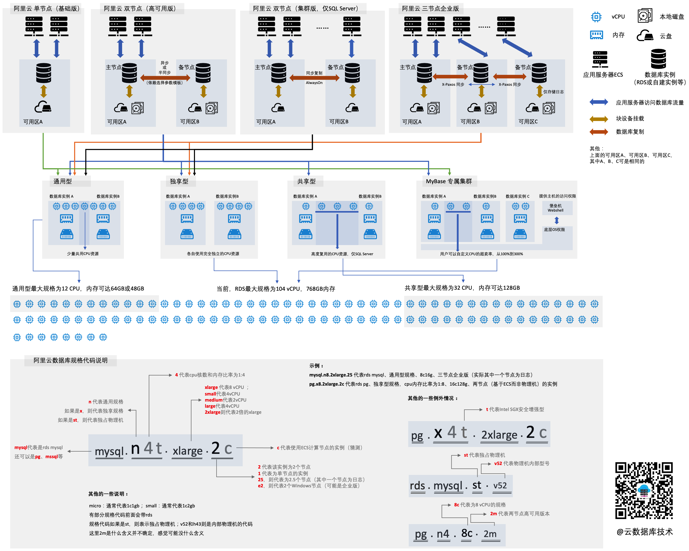
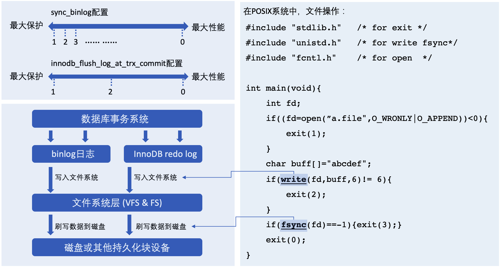

# 一张图读懂阿里云数据库架构与选型

在传统数据库选择时，通常关注的是机器的硬件、OS选型、主要的性能参数配置，从而搭建出更加高性能的、适合业务环境的数据库实例。云数据库通过全托管的形式向用户屏蔽了底层硬件的管理，软件的安装与配置。但是，如果希望获得更加高性能、高性价比、符合业务诉求的数据库，则需要对云数据库的架构和规格有较为系统的了解。了解，何时可以选择高可用版本，何时需要使用三节点版本，何时使用全球数据库等，既能够高效的支持业务发展，又能够适当降低成本。

## 阿里云RDS的基础架构与规格

### 架构与规格大图

下图较为网站的概括了阿里云数据库实例规格的主要架构、实例类型、规格代码等内容。从高可用区架构上，分为单节点（基础版）、双节点（高可用版）以及三节点企业版、集群版（仅SQL Server AlwaysOn）。从资源共享与隔离上，则分为通用型、独享型、共享型和独占物理机（可以理解为是特殊的独享型）。从磁盘使用上的不同，则分为云盘版和本地盘版。

当前[^3]，RDS最大规格为104核CPU，768GB内存。其中通用型，最大为12核CPU；共享型最大为32核CPU。

如下大图较为完整的概况了阿里云RDS的主要架构类型、资源共享方式、规格代码等内容：

### 主要的架构类型

数据库通常是企业业务架构中的核心组件，数据库的可用性与业务可用性直接相关。所以，高可用是云数据库架构选型第一个需要关注的内容。

从高可用角度，阿里云数据库提供了基础版（即单节点）、双节点高可用版、三节点企业版。不同的版本，则是在成本、可用性、数据可靠性之间的平衡：

* 单节点通过简单的架构，以最低的成本提供了基本可用的云数据库服务
* 双节点高可用版则是适合绝大多数业务场景的模式，两个节点分布于一个地区的两个可用区，故障时，切换速度较快，数据双副本，可靠性也比较高
* 三节点企业版，则通过X-Paxos实现底层数据一致，并以三副本（两份数据+一份日志）保障数据可靠性

#### 基础版（即单节点版本）

阿里云基础版使用阿里云云盘作为数据库存储，挂载在数据库地计算节点上，实现了存储与计算的分离。这使得，计算节点出现故障的时候，重新使用一个新的计算节点，再重新挂载原来的数据库存储，即可启动数据库，恢复出现故障的数据库。所以，在计算节点发生故障的时候，RPO通常小于1分钟，RTO则为5分钟~一小时。当整个可用区发生故障的时候，RPO和RTO的值则依赖数据库备份的频率情况。

#### 高可用版

两节点高可用是用户使用最多的版本，也是数据库最为常见的架构。数据库有主备两个节点组成，通过数据库层的逻辑日志进行复制。相比单节点，无论是在数据可靠性、服务的可用性都有非常大的提升。由于主备节点都在同一个大region，日志延迟通常都非常小，所以发生单节点故障时，高可用版的数据可靠性通常是比较高的。注意到，AWS对应的双节点版本的RPO是零，那么阿里云数据库怎样呢？

具体的，对阿里云RDS MySQL，阿里云的两节点高可用，根据所选择的参数模板分为如下三类：

* 高性能：sync_binlog=1000, innodb_flush_log_at_trx_commit=2, async
* 异步模式：sync_binlog=1, innodb_flush_log_at_trx_commit=1, async
* 默认：sync_binlog=1, innodb_flush_log_at_trx_commit=1, semi-sync

其中，“高性能”版本和“异步”版本，都是异步复制，在发生主节点故障时，因为复制为异步的，可能会有少部分的事务日志没有传到备节点，则可能会丢失少部分事务。也就是说，这两个版本为了实现更好的性能，在数据库的RPO上做了小的让步。“默认”版本，使用了半同步复制，通常，数据可靠性会更高。单因为半同步可能会有退化的场景，所以，该模式下数据复制还是在极端的情况下，还会有数据丢失的可能性。

那么，既然“异步”模式和“高性能”都有数据丢失的风险，他们的区别是什么什么呢？简单的概括，“异步”产生微小数据丢失的可能性更小。因为，主备节点通过设置sync_binlog=1, innodb_flush_log_at_trx_commit=1，可以最大可能性的保障，主节点的数据可靠性。

事实上，高可用版本是可以满足绝大多数业务场景的需要的，一方面同一个可用区内数据传输延迟非常小，日志传输通常都非常通畅，即便主节点发生故障，实际的情况中，通常不会出现日志延迟。另外，主节点失败后，通常可以通过重启等方式恢复，云厂商的硬件都有着较为标准的硬件过保淘汰的机制，硬件完全不可用的情况也并不多。另外，底层磁盘会通过硬RAID或者软RAID的方式，保障磁盘数据存储的可靠性，数据即便是在一台机器上，也会保存在两块盘上。

两节点高可用版本在某些特殊场景下，数据还是存在一些不可用风险，例如，当其中一个节点发生故障，而本地数据量又非常大时，需要重新在一台新的机器上搭建备节点时，因为数据量较大，重建时间通常会比较长，而这时候，主节点则会一直单节点运行，如果不幸主节点再出现故障，则会出现不可用或者数据丢失。如果，对数据的安全性有更高的要求，则可以考虑选择“三节点企业版”。

#### 三节点企业版

当前仅RDS MySQL有该版本。三节点企业版使用了基于X-Paxos[^4]的一致性协议实现了数据的同步复制，适用于数据安全可靠性要求非常高的场景，例如金融交易数据等。三节点中，有一个节点仅存储日志，以此实现接近于两个节点的成本与价格，实现更高的数据安全与可靠性。

三节点企业版在创建的时候，可以选择分布在1~3个可用区。如果需要跨可用区的容灾，则可以让三个副本分布于三个可用区，如果需要更高的性能，则可以让三个副本都在同一个可用区。

#### 关于MySQL的参数sync_binlog, innodb_flush_log_at_trx_commit

在阿里云RDS的高可用参数模板选择中，不同的参数模板，最主要的区别就是这两个参数的不同配置。这是MySQL和InnoDB在数据安全性上最重要的两个参数。双1设置（sync_binlog=1, innodb_flush_log_at_trx_commit=1）是数据安全性最高的配置。

数据库是日志先行（WAL）的系统，通过事务日志的持久化存储来保障数据的持久化。在一般的Linux系统中，数据写入磁盘的持久化需要通过系统调用fsync来完成，相对于内存操作，fsync需要将数据写入磁盘，这是一个非常“耗时”的操作。而上面这两个参数就是控制MySQL的二进制日志和InnoDB的日志何时调用fsync完成数据的持久化。所以，这两个参数的配置很大程度上反应了MySQL在性能与安全性方面的平衡。

其中，sync_binlog代表了，MySQL层的日志（即二进制日志）的刷写磁盘的频率，如果设置成1，则代表每个二进制日志写入文件后，都会进行强制刷盘。如果设置成0，则代表MySQL自己不会强制要求操作系统将缓存刷入磁盘，而由操作系统自己来控制这个行为。如果设置成其他的数字N，则代表完成N个二进制日志写入后，则进行一次刷写数据的系统调用。

innodb_flush_log_at_trx_commit则控制了InnoDB的日志刷写磁盘的频率。取值可以是0,1,2。

* 其中1最严格，代表每个事务完成后都会刷写到磁盘中。
* 如果该参数设置成0，那么在事务完成后，InnoDB并不会立刻调用文件系统写入操作也不会调用磁盘刷写操作，而是每个1秒才调用一次文件系统写入操作和磁盘刷写操作。那么，在操作系统奔溃的情况下，可能会丢失1秒的事务。
* 如果该参数设置成2，那么，每次InnoDB事务完成的时候，都会通过系统调用write将数据写入文件（这时候可能只是写入到了文件系统的缓存，而不是磁盘），但是每个1秒才会进程一次刷写到磁盘的操作。那么，在操作系统奔溃的情况下，可能会丢失1秒的事务。相比设置成0，该设置会InnoDB会更加频繁的调用文件系统写入操作，数据的安全性要比设置成1高一些。

我们可以通过下图来理解这两个参数的含义，以及在操作系统中对应的“写入文件系统”与“刷写数据到磁盘”的含义。首先，在数据库的事务处理过程中，会产生binlog日志和InnoDB的redo日志，这两个日志分别在MySQL Server层面和InnoDB引擎层面保障了事务的持久性。在事务提交的时候，数据库会先将数据“写入文件系统”，通常文件系统会先将数据写入文件缓存中，该缓存是在内存中，这样就意味着，如果发生操作系统级别的宕机，那么写入的日志就会丢失。为了避免这种数据丢失，数据库接着会通过系统调用，“刷写数据到磁盘”中。此时，即可以认为数据已经持久化到磁盘中[^2]。

这时，再回头看看阿里云RDS的参数模板。在高性能模板中，"sync_binlog=1000, innodb_flush_log_at_trx_commit=2, async"，代表了在写入1000个binlog日志后再进行刷写数据到磁盘的操作，InnoDB的日志则都会先写入文件系统，然后每隔一秒进行一次刷写数据到磁盘。在“默认模式下，“默认：sync_binlog=1, innodb_flush_log_at_trx_commit=1, semi-sync”，则是最严格的日志模式，也就是会保障每个事务日志安全的刷写到磁盘。

日志的刷写模式对性能有非常大的影响。如果不去关注这些参数，就直接去测试不同云厂商的性能，则会发现，云厂商之间的RDS有着非常大的性能差异。通常，这些差异并不是厂商之前的技术能力导致的，更多的是由于他们在对于安全性和性能的平衡时，选择的不同的平衡点。

### 资源复用与规格

从资源共享与隔离上，RDS又分为：通用型、独享型和共享型。具体的：

* “通用型”适合一般的业务使用场景，但有一定的CPU共享率，也就说是，有一定的概率实例的资源可能会被其他实例争抢而导致性能的波动[^1] 。
* “独享型”则使用完全独享的CPU的资源和内存资源，不会共享其他人的资源，自己的资源也不会被其他人共享，所以，有更稳定的性能。
* “共享型”则与通用型类似CPU资源会被共享，并且共享率更高，所以性价比更高，同时受到资源争抢的影响的可能性也更大，当前仅SQL Server支持。

除了，上述主要规格类型之外，阿里云还提供了“独占物理机”规格，选择该规格的用户可以完全的独占一台物理机的资源。

|                          |      通用型       |              独享型              |          共享型          |
| :----------------------: | :---------------: | :------------------------------: | :----------------------: |
|   CPU是否有共享与争抢    |        有         |                无                |            有            |
|   内存是否有共享与争抢   |        无         |                无                |            无            |
| 磁盘存储是否有共享与争抢 |        有         |                无                |            无            |
|          性价比          |        中         |                低                |            高            |
|        性能稳定性        |        中         |                高                |            低            |
|           规格           | 最大规格为12核CPU |        最大规格为104核CPU        |    最大规格为32核CPU     |
|         适用场景         |  一般的业务场景   | 稳定性要求高、响应时间敏感的系统 | 响应时间不那么敏感的系统 |

### 专属集群MyBase

专属集群MyBase是阿里云推出地一种特殊的形态。可以理解为，是一种全托管RDS与自建数据库的中间形态。在全托管的RDS基础上，提供了两个重大的能力：

* 允许用户登录数据库所在的主机
* 允许用户配置数据库实例CPU的“超配比”[^5]  

当然，要求是用户一次购买一个非常大的、可以容纳多个RDS实例的“大集群”，专属集群则提供了以上两个能力，以及RDS其他的基本能力，包括安装配置、监控管理、备份恢复等一系列生命周期管理能力。

使用这种规格，用户具备更大的自由度。一方面可以登录主机，观测主机与数据库的状态，或者将自己原有的监控体系部署到专属集群中。另一方面，用户可以根据自己的业务特点，控制集群内的CPU资源的超配比。对于核心的应用，则使用资源完全不超配的集群；对于响应时间没有那么敏感的应用，例如开发测试环境，则可以配置搞到300%的CPU超配比，以此大大降低数据库的成本。

### 其他

#### 本地盘与云盘版

阿里云的主要版本都会支持本地SSD和高性能云盘。他们的差异在于计算节点与磁盘存储是否在同一台物理机器上，对于使用高性能云盘的规格，通常是通过挂载一个同地区的网络块设备作为存储。

对于阿里云厂商来说，未来主推的将是云盘版。原因是云盘相对于本地盘来说，有很多的优势：

* 统一使用云盘版，让云厂商的供应链管理变得简单。如果使用本地盘版本，意味着数据库机型定制性会增强，供应链的困难会增加产品的成本，最终影响价格。另外，简单的供应链也会让产品的部署更加标准化，更加敏捷的实现多环境多区域的部署。
* 使用云盘版，也可以理解为是“存储计算分离”的架构，那么如果计算节点故障，则可以快速通过使用一台新的计算节点并挂载云盘，而实现高可用。这种方式有着非常好的通用性，无论是哪种数据库都可以使用，而无需考虑数据库种类之间的差异。无论是MySQL还是PostgreSQL、Oracle都可以使用这种方式实现高可用。
* 云盘版本身提供了一定的高可用与高可靠能力。云盘本身数据可以通过RAID或者EC算法实现数据的冗余与高可用，并且可以将数据分片到不同的磁盘与机器上，整体的吞吐会更高。
* 云盘版本身是分布式的，可以提供更高的吞吐，通常还可以提供更大的存储空间。例如，各个云厂商的云盘存储都可以提供12TB或32TB的存储空间，基本上可以满足各类业务需要。

当然，使用云盘也有一些缺点，例如，相比本地盘，云盘的访问延迟更大，需要通过网络访问，而对于数据库这类IO极其敏感的应用，本地磁盘的IO性能的稳定性通常会更强一些

#### 通用型与独享型的性能

独享型规格的资源完全有用户独立使用，价格通常更贵。而通用型则因为部分资源的共享，会导致性能在某些不可预期的情况下发生一些不可预期的波动。而独享型规格也更贵，更多的企业级场景，也会推荐使用独享型，会有很多人会认为独享型的性能也更高。而实际上，如果做过实际测试就会发现，一般来说，相同的规格，通用型的性能与吞吐通常都会更高。

所以，实际情况是，通用型的价格更加便宜，性能也会更好。缺点在于，可能会出现一些不可预期的性能波动，而因为大多数数据库应用都是IO密集型的，所以，实际场景中，这种不可预期的波动并不是非常多。

所以，这两个版本的选择，需要用户根据自己的实际情况去选择。如果，可以接受偶尔的性能波动，则一定是建议选择通用型的；如果应用对数据库的响应时间极其敏感，则应该选择独享型。另外，当前，通用型最大规格仅支持12核CPU，所以对于压力非常大系统，则只能选择独享型。

#### 关于超配比

对于在线数据库应用来说，通常是IO或者吞吐密集型的。CPU资源在很多时候，会有一定的冗余。对于云厂商来说，则可以通过超配CPU的售卖率来降低成本，同时也降低数据库资源的价格，这就是通用型背后重要的逻辑。

而一般来说，可以超配的通常只有CPU资源。磁盘资源虽然可以超配，但是实际使用中，是不能重合的，当用户的磁盘占用增到购买值的时候，资源则不可以共享，这与CPU的超配并不相同。内存资源则更加是独享的，Buffer Pool的通常是满的，无论这些内存页是否被实际使用，数据库总是会尽力在内存中存储尽可能多的数据。

MyBase提供的一个重要配置项，就是可以用户自定义底层资源的超配比，该比率取值从100%~300%。也就是说，一个32核CPU的资源，最多可以分配给12个8核CPU的实例使用，看起来是96=12*8个CPU被使用，即实现了300%的超配比。

超配比有时候也会被称为超卖率。

## 参考文档

* [阿里云RDS for MySQL 发布三节点企业版](https://developer.aliyun.com/article/719163) @阿里云开发者社区
* [RDS 使用参数模板](https://help.aliyun.com/document_detail/130565.html?spm=5176.rdsbuy.0.0.40a5752faAKwOo) @阿里云数据库文档
* [sync_binlog](https://dev.mysql.com/doc/refman/5.7/en/replication-options-binary-log.html#sysvar_sync_binlog) @MySQL Documentation
* [innodb_flush_log_at_trx_commit](https://dev.mysql.com/doc/refman/5.7/en/innodb-parameters.html#sysvar_innodb_flush_log_at_trx_commit) @MySQL Documentation  
* [实例规格族](https://help.aliyun.com/document_detail/57184.html?spm=a2c6h.12873639.article-detail.15.29552135nJxYP0&source=5176.11533457&userCode=nkfhf8j0&type=copy) @ 阿里云数据库文档

[^1]:阿里云数据库分为本地盘版本和云盘版本，其中本地盘版本CPU和内存会有共享，而存储不会共享，这与本地盘版本是不同的。
[^2]:  有些磁盘或者RAID卡层面还会有缓存，此时则要求这些这些缓存系统具备自己的备用电池，以保证主机发生宕机时该部分缓存可以持久化保存。 
[^3]: 最大规格会随着硬件发展而发展，这里是编写本文稿的时间，约为2022年4月。
[^4 ]: X-Paxos是由阿里云数据库研发的一个Paxos协议或变种。
[^5]: 有时候也被称为超卖率，具体参考小结“关于超配比”

