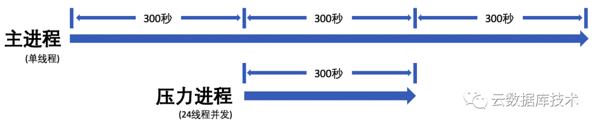
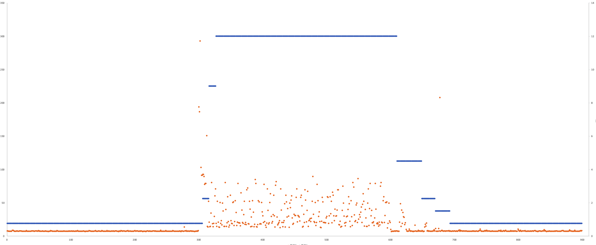
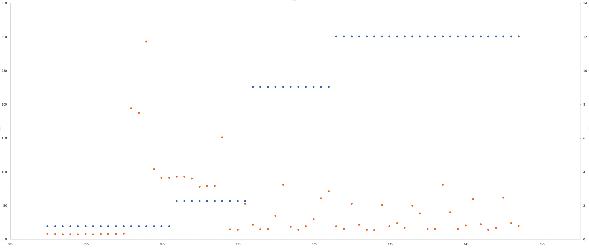
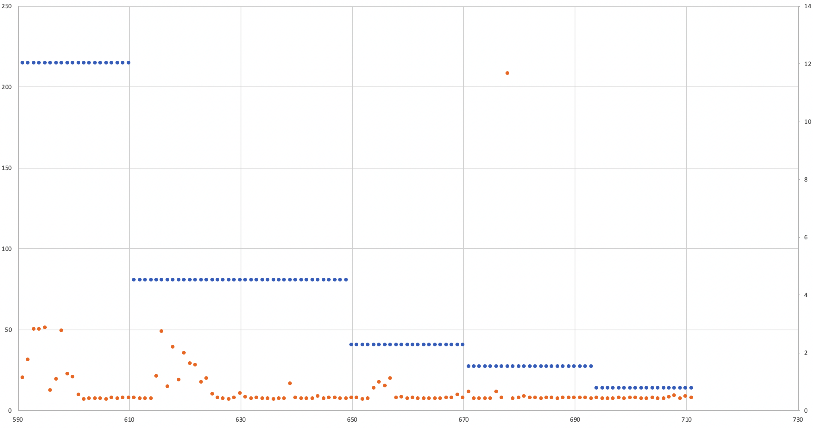

# 阿里云RDS Serverless测评

在4月底，阿里云RDS Serverless正式公测发布。第一时间申请了公测资格，并进行了测试验证。测试完成后，整体上，还是非常值得期待的，值得开发者们去了解和小范围（例如开发测试环境）尝试。测试中，该Serverless版本的升/降配速度非常快，约10秒完成压力检测与变配，升配时性能表现非常平稳，降配时性能比较平稳。只是目前只支持基础版（单节点实例），应用场景还比较有限，不过对于开发测试环境这类，可用性要求没那么高，且性能峰谷明显的场景，是可以轻松节省超过50%成本的，而且在需要的时候，性能还会非常不错。

## 整体测试结论概述

* 在系统压力突增时，阿里云RDS Serverless的响应也非常快，约10秒内就可以完成变配；在之前的Aurora Serverless v2测试中，升配的时间是差不多的，都是10秒以内。
* 在系统压力下降时，阿里云RDS降配的速度也非常快，在系统压力降低之后，10秒就完成了降配。另外，当前的版本，因为降配非常快，也导致降配后，性能出现了一些波动，持续约10秒，波动幅度从约8毫秒的响应时间增长到30~50毫秒，在两次降配之后，都出现这个小波动。
* Aurora降配更加“保守”，观测了50秒，之后才开始降配。但这50秒应该是有一些讲究的，在降配之后，Aurora的性能依旧非常平稳，没有任何波动。也就是，降配过程中清除出内存池的数据页都是确确实实不再使用的，这里可能需要深入的观测InnoDB的Buffer Pool收缩时的表现，避免将可能使用数据页清理出内存。
* 当然，现在阿里云Serverless还是刚刚公测，作为尝鲜和测试使用，甚至在开发测试环境尝试使用，都是非常合适和推荐。而且，在公测阶段，可免费创建2个实例体验，最大8RCU，即约8c16g内存的实例，免费周期3个月：[云数据库 RDS Serverless版公测申请](https://page.aliyun.com/form/act422185691/index.htm?spm=5176.rdsbuy.0.0.6c8a752fJMCJsl) （有羊毛就薅吧）。

## 测试方法说明

整体的测试方法与之前做Aurora Serverless v2类似。首先，启动一个单线程sysbench，作为测试**"主进程"**，程序运行900秒，在**"主进程"**运行300秒后，再启动一个**"压力进程"**（24并发的sysbench进程）向系统施压，该进程运行300秒后退出，在这个过程中，我们观测"主进程"的rt变化，以及整个过程中，实例规格的变化（依旧以buffer pool为指标）。更详细的描述可以参考：[实测Aurora Serverless v2](https://mp.weixin.qq.com/s/0b3RjO8KpYBBD08WpYH5yQ)。

## 测试结果与分析

整体过程如下：

- 下图黄点代表主进程每秒RT的变化；"蓝点"（连成线）代表秒级别buffer pool的变化
- 在第300秒，“压力进程”给出额外压力之后，系统开始升配，经过三次升配之后，到最大规格
- 在第600秒，“压力进程”推出，经过了4次降配，降级到最低规格

### 升配过程

* 从如下放大的图可以看到，在“压力线程”启动的第300秒，“主线程”的响应时间立刻增长到了300ms。
* 该实例在之后的7秒内完成升配，实例响应时间也立刻降了下来，降到约75毫秒
* 之后，再过10秒（约第317秒），完成了第二次升配，实例响应时间再次下降，约到30毫秒
* 再之后，再过约10秒（约第328秒），再次升配，但是此时响应时间不再有什么变化

### 降配过程

* 第600秒，压力进程退出，约11秒后，完成降配。但是，在第15秒性能出现明显波动，持续10秒
- 第650秒，完成第二次降配，4秒后性能出现波动，持续约5秒
- 第670秒，再次降配，性能再次波动，并出现一个异常点，响应时间非常大（约200ms）
- 之后，系统平稳运行

### 其他

* 当前RDS Serverless处于公测阶段，没有SLA保障，且仅支持基础版、区域支持也有限，虽然降配和升配都比较快，也比较稳定，但是还不适合生产环境。
* 当前，实例规格区间为0.5~8 RCU，最大规格也还比较小。
* 在这次对比测试中，也发现，相比AWS，阿里云在同一个可用区的网络延迟是更低的，仅5~10ms，而Aurora同可用区响应时间约为15~20ms。
* 据了解，阿里云今年还是会在这个方向加大投入，还会有一些大的版本和改进发出来，拭目以待吧。
