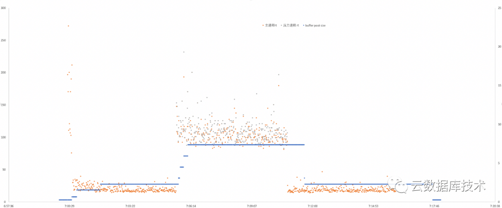
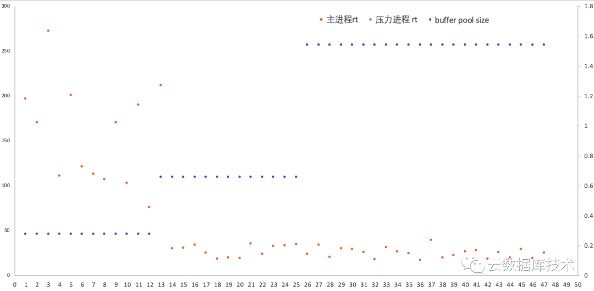
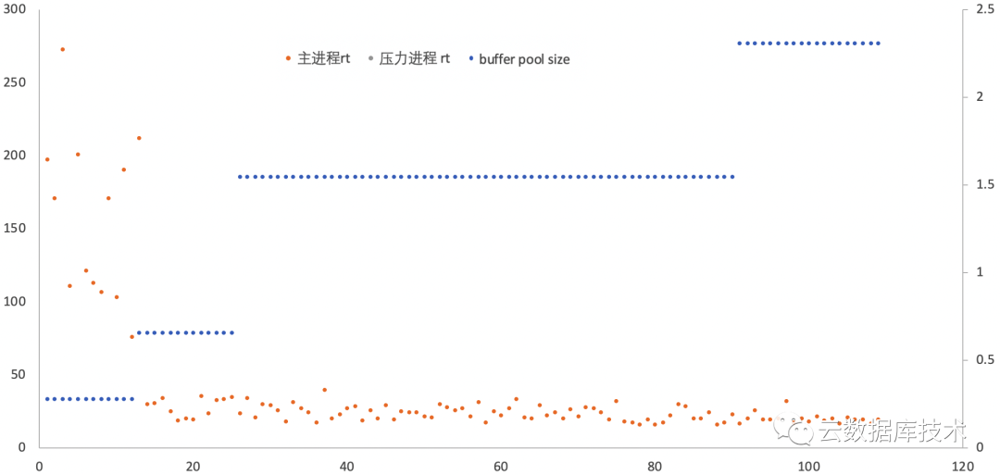
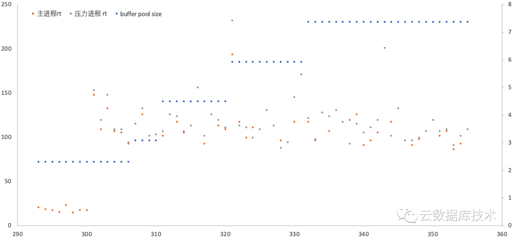
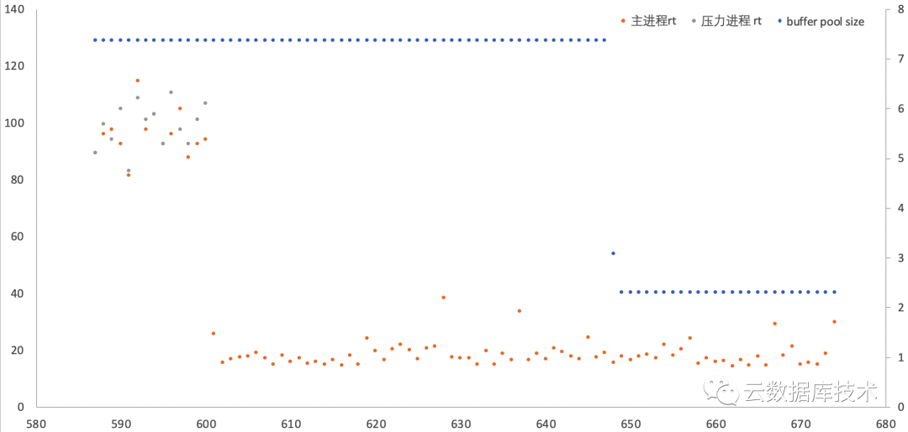
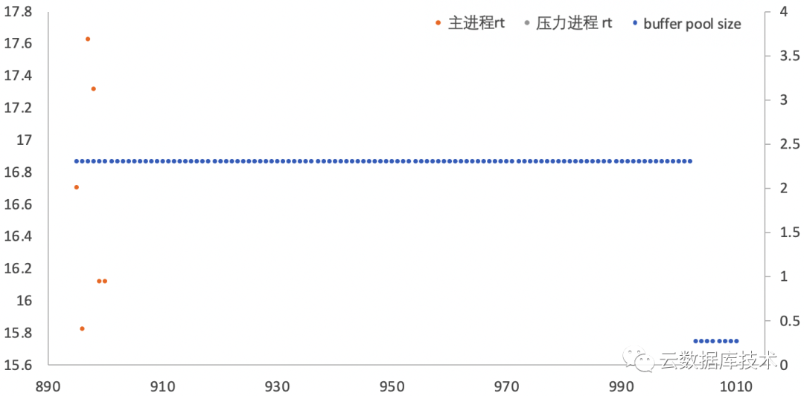

# 实测Aurora Serverless v2

Aurora自2014年发布以来，一直是AWS的最核心数据库产品，而Serverless则是这个产品最重要的功能之一了。在2018年08月，Serverless功能刚刚GA，当时做过一次测试。在2020年底的re:Invent上，Andy Jassy宣布Aurora发布Serverless v2，时隔一年半，终于GA，一起来看看实际效果怎样吧。

在最近看到该功能的介绍文章中，使用了"几分之一秒内扩展"、" scales instantly and nondisruptively "等描述，对此，我是保持怀疑的，这也要实测一下的原因，从一个用户感受的角度，看看一次升级(scaling)需要多长时间。

## 测试结果概述

- 在这次实际测试中，新的Serverless v2，可以将scaling up的时间降低到10秒级别。系统压力上来后，首次升级(scaling up)花了13秒，之后的几次升级分别花了7秒、4秒、10秒等。在这几秒内，Aurora需要完成监控采集、分析与决策，变配动作完成等动作。于用户侧，系统压力突增时，10秒内Aurora就会完成升级，这是非常实用和强大的。
- 相比4年前GA版本数分钟级别的升级(scaling)，新的版本提升非常大。不过，与宣传的亚秒级( in a fraction of a second )还有差距的。当然，一种猜测是，"亚秒内"完成的是变配动作本身，不包括监控、决策与命令下发等过程。
- Scaling down是逐步阶梯式完成的，每次间隔约1分钟，这是符合预期的。
- 新的版本与旧版本有非常好的兼容性，可以作为旧版本的replica，然后切换为主节点，也就可以完成平滑的升级。新的版本，支持MySQL 8.0和PostgreSQL 13版本。
- 该功能的客户价值是非常明显的：在更多的业务场景中，可以帮助用户降低成本，同时也可以帮助应对更多的突发流量。另外，云计算的"使命"之一是通过统一的底层资源调度，提升资源利用率，降低资源使用成本，而该功能，在交易数据库的场景，把这个"使命"的粒度降低到了"秒"级别。用好了该功能，在很多场景中，降低50%的数据库成本应该是容易的。

## 测试设计

因为无法登录到Aurora主机上，很多指标无法直接观测，AWS控制台给出的指标也只有1分钟级别，而且目前也没有看到像之前版本，给出详细的变配Event。实际上，要观测秒级别的变化，是比较困难的。这里，决定从客户端角度去观测，并使用了如下测试方案：

- 使用sysbench作为测试程序，并将--report-interval设置成1s，并使用99%的延迟作为平均延迟（响应时间rt）
- 同时使用mysql client持续观测buffer pool的大小，以该大小的变化作为ACU变化的指标

### 测试流程

- 首先，启动一个单线程sysbench，作为测试**"主进程"**，程序运行900秒
- 在**"主进程"**运行300秒后，再启动一个**"压力进程"**（24并发的sysbench进程）向系统施压，该进程运行300秒后退出

在这个过程中，我们观测"主进程"的rt变化，以及整个过程中，实例规格的变化（以buffer pool为指标）。

### 测试结果与分析

整个测试过程中，主进程响应时间(rt)和Aurora规格（以buffer pool size代表）变化过程如下：

- 黄点代表"主进程"响应时间(rt)随时间(秒)变化趋势
- 灰点代表"压力进程"响应时间(rt)随时间(秒)变化趋势
- "蓝点"（连成线）代表buffer pool的随时间变化趋势
- 横坐标是时间，间隔为1秒
- 左侧纵坐标单位为毫秒，是rt的单位；右侧纵坐标单位是GB，是buffer pool大小单位

整个测试过程共15分钟(900秒)，接下来我们拆开成几个阶段看看整个过程是怎样的。

### 前两分钟发生了什么

- 前10秒，规格为默认的0.5ACU，rt值都较高，超过150ms
- 第13秒，buffer pool增长到0.65GB，rt值降低为约20ms
- 第26秒，bp增长到1.5GB，rt值没有明显变化
- 第91秒，bp增长到2.3GB，rt值没有明显变化

再看看这个过程，起初，虽然主进程是单线程的，但初始规格是0.5ACU，依旧容量不足，反应在上图中，主进程rt非常高，超过150ms。在第13秒，Aurora自动升级到了约0.65GB（当然对应的CPU也做了升级），很快，立竿见影，rt马上降下来，非常符合预期。之后，Aurora再次升级到1.5GB，可以看到从rt角度来看并没有什么效果，之后又升级到2.3GB。

### 系统压力突增的时候

在第300秒，"压力进程"给了系统额外的压力，具体的：

- 第300秒，“压力进程”给了系统额外的压力
- 第307秒，buffer pool增长到3.0GB，7秒完成升级（scaling）
- 第311秒，bp增长到4.5GB，4秒内再次完成升级
- 第321秒，bp增长到5.9GB，10秒再次完成升级
- 第332秒，bp增长到7.4GB，10秒再次完成升级
- 之后，全程稳定在该值，可能是因为该buffer pool值是该规格的最大允许值

整个过程中，Aurora在"压力进程"给出压力后的第7秒就完成了scaling。这7秒内，Aurora需要完成采集上报、分析决策、完成动作，要将这个功能规模化、产品化出来，还是非常复杂的。

### 系统压力降低的表现

- 第600秒，“压力进程”结束退出，主进程rt降低为约20ms
- 第649秒，buffer pool降低到2.3GB

也就是说，在49秒后，开始逐步释放多余的资源。

### 最后

- 第900秒，测试"主进程"结束
- 第1003秒，buffer pool降低为0.27GB

最后，在压力消失后的100秒后，scaling down到更小规格。

## 其他

补充说明：

- 测试使用了新加坡可用区ap-southeast-1a的资源（测试客户端ec2和aurora都在这）
- Aurora使用serverless v2 3.02.0(8.0.23)，capacity range是0.5ACU ~ 8 ACU；客户端ec2规格为8c16g。
- 注意到Aurora的升级粒度，不是以ACU为最小粒度的，从Serverless Capacity的趋势图可以看到很多更细粒度的ACU。
- Serverless Capacity这个趋势图并不好找，需要点击进入CPU的大图后，通过选项卡切换出来（感觉这应该是一个Bug）。
