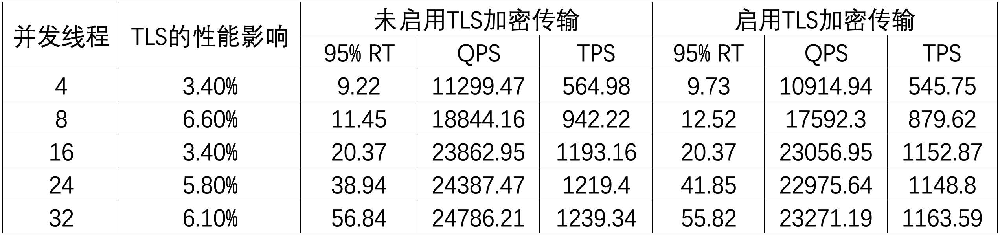

# 开启TLS传输加密对数据库性能的影响

## 概述

随着云数据库的普及，数据库的传输加密也会随之被广泛使用。本文，将使用通用的sysbench测试来看看，开启TLS传输对数据库的性能有什么样的影响。

## 原理层面的分析

开启TLS传输加密之后，分别会在建立连接、数据传输两个阶段对性能造成影响。因为建立连接的过程通常是一次性的，连接会被复用，所以这部分的性能开销通常是可以接受的。在传输阶段，是传输加密对性能影响的重要阶段，这时候通常会使用对称加密算法（例如AES256）对数据进行加密，那么实际的对称加密的性能就是对TLS传输加密性能影响最大的部分。需要注意的是，如果应用使用的是短链接（应该尽量避免使用这种方式），TLS加密的密钥交换阶段也会对每个连接建立的过程都有一定的性能影响。

## 云数据库实际测试

这里选择对RDS MySQL进行测试，云厂商则各自选择国外、国内Top 1的云厂商AWS和阿里云。

### 测试方法说明

使用sysbench 1.1.0版本，测试类型为oltp_read_write，相关参数如下：

- --mysql-ssl=REQUIRED 是否使用TLS加密传输
- --percentile=95 关注95%Query的延迟
- --histogram=on 可以查看延迟分布情况
- --time=600  sysbench运行的总时间（秒）
- --warmup-time=60   开始计算性能前预热时间（秒）
- --table_size=1000000  单表100万条记录
- --tables=5 共测试5个表

### AWS RDS MySQL开启传输加密TLS的性能影响

RDS规格选择了db.m5.xlarge（4c16g），多可区版本，8.0版本，100GB存储，Provisioned IOPS。

测试中，开启TLS后性能影响约为3%：

### 阿里云RDS MySQL开启传输加密TLS的性能影响

选择了mysql.x4.large.2c规格（4c16），MySQL 5.7版本，50GB存储，IOPS 4300，主备均在同一个可用区。

测试中，看到性能影响约为

### 阿里云ECS自建MySQL 8.0开启传输加密的性能影响

* MySQL Server端使用了规格ecs.g6e.xlarge(4c16g)
* OS使用的是Alibaba Cloud Linux 3.2104 LTS 64位
* 磁盘使用了 ESSD 50G  PL1
* MySQL配置为：
  * sync_binlog 1000 ； innodb_flush_log_at_trx_commit 2
  * Buffer Pool为12G
  * 其他均为默认配置

## TLS性能影响测试汇总

整体上，开启TLS对性能（QPS吞吐）的影响约为2%~8%，不同的环境、版本会有一些不同。

## 其他的一些测试参考

在2014年的IEEE International Conference on Cloud Engineering (IC2E)有一篇论文测试了DynamoDB、Cassandra开启TLS的性能影响：[Benchmarking the Performance Impact of Transport Layer Security in Cloud Database Systems](https://ieeexplore.ieee.org/document/6903455)，文中的测试，吞吐性能影响分别为5%和9%左右。另外，不同的加密算法选择也会对性能有一定的影响，例如，文中的Cassandra测试中，AES128和AES256约有10%左右的性能影响。

2021年，yugabyteDB的TPC-C测试中，性能约有5%的影响：[Measuring the Performance Impact of TLS Encryption Using TPC-C](https://blog.yugabyte.com/measuring-the-performance-impact-of-tls-encryption-using-tpcc/) 

## 小结

整体上，开启传输加密时，对性能的影响约为2%~8%，不同的环境不同的数据库版本会有一些不同。在实际的生产环境中，可以默认打开该功能，应用连接是否需要开启，可以根据实际场景决定，通常，如果Client端和数据库服务器不再同一个网络环境中，则建议Client端启用加密传输。

