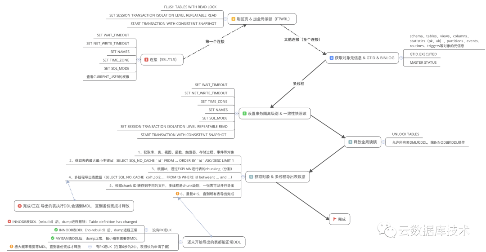

##  图解MySQL逻辑备份的实现流程

### 1. 摘要

数据作为一家公司的重要资产，其重要程度不言而喻。数据库为数据提供存取服务，担任着重要的角色，如果因数据误删、服务器故障、病毒入侵等原因导致数据丢失或服务不可用，会对公司造成重大损失，所以数据库备份是数据系统中最为重要的一环。

MySQL备份按照类型分为**逻辑备份、物理备份、快照备份**，本文将通过**图文方式**对常见的逻辑备份工具的**一致性备份**流程进行说明，来进一步了解逻辑备份的整个流程是怎么实现的。

### 2. 概念

逻辑备份是数据库对象级的备份，其将数据库里的对象通过SQL查询出来并转储到文件中，包含了用于创建转储对象（数据库，表，触发器、自定义函数、存储过程等）的CREATE语句，和用于将数据加载到表中的INSERT语句。

**一致性备份**是指在某个时间点，导出的数据与导出的备份文件信息匹配，如果导出了多张表的数据，这些不同表之间的数据都是同一个时间点的数据，MySQL可以通过全局锁（FTWRL，锁表备份）和事务（single-transaction，一致性快照）实现。

锁表备份在Server层实现，备份期间该实例只能进行SELECT操作；事务的一致性快照备份在引擎层实现，支持MVCC引擎表（InnoDB）的备份，期间实例可以对任何表进行DML操作，DDL操作需要根据具体情况分析，本文会对该情况（一致性快照备份）进行说明。

常见的逻辑备份工具：MySQL官方的`mysqldump`、`mysqlpump`、`mysqlshell`的dump方法和第三方开源的`mydumper。

### 3. 工具说明

#### 3.1 mysqldump

**说明**：mysqldump使用**单线程**对表进行SELECT查询并转储到文件来达到备份的目的，作为MySQL最“古老”的备份工具，被广泛的使用在备份中。

- **备份命令**

```shell
mysqldump -udump_user -p -P3306 -h127.0.0.1 --master-data=2 --single-transaction --default-character-set=utf8 --all-databases --triggers --routines --events > all.sql
```

- **备份流程**

开启 general_log 查看备份流程，大致的备份流程如下图所示：


* **流程说明**

1. 连接数据库，设置当前变量，刷脏页并加一个全局读锁，此刻数据库实例只能SELECT，不能执行其他任何类型的操作（会影响到业务），再设置事务隔离级别和开启一致性快照，并获取BINLOG和GITD信息，此时所有的支持事务的表（INNODB）数据均来自同一时间点。最后再释放全局读锁，此刻数据库实例可以执行任何操作（正常情况下，加全局读锁和释放锁的时间很短）。
2. 获取备份对象的元数据信息并**单线程**导出表「SLEECT *」。导出表分3种情况：已经导出完成、还未导出和正在导出：

- 对于已导出的表，可以做DDL操作（使用SAVEPOINT提前释放导出表的metadata lock）；

- 对还未导出的表，INNODB表的DDL操作，能否执行成功取决于DDL的操作方式：**no-rebuild**方式的DDL执行成功，**rebuild**方式的DDL执行失败（Table definition has changed），MyISAM引擎的表都能执行成功；

- 对正在导出的表，DDL会出现MDL，此时对该表后续的查询都会出现MDL，导致业务不可用（时间根据备份时长决定），直到该表导出完成。

3. 获取除表外的其他对象：自定义函数、存储过程、VIEW等。
4. 获取当前的GTID信息，所有对象的导出均转储到**一个文件**，完成备份。

#### 3.2 mysqlpump

**说明**：mysqlpump**并行导出**功能的架构为：队列+线程，允许有多个队列，每个队列下有多个线程，一个队列可以绑定1个或者多个数据库。在mysqldump的基础上额外支持了：并行备份、延迟创建索引、备份用户、对象的通配符过滤、DEFINER忽略等特性。

mysqlpump的备份是基于表并行的，对于每张表的导出只能是单个线程的，如果一张表非常大，大部分的时间都是消耗在这个表的备份上，并行备份的效果可能就不明显。

- **备份命令**

```shell
mysqlpump -udump_user -p -P3306 -h127.0.0.1 --set-gtid-purged=on --default-parallelism=2  --single-transaction --default-character-set=utf8 --exclude-databases=mysql,sys,information_schema,performance_schema > all.sql
```

- **备份流程**

开启 general_log 查看备份流程，大致的备份流程如下图所示：


**流程说明：**

1. 多线程连接数据库，设置当前变量，刷脏页并加一个全局读锁，此刻数据库实例只能SELECT，不能执行任何类型的操作（会影响业务），再设置事务隔离级别和开启一致性快照读并获取GITD 信息，此时所有的支持事务的表（INNODB）数据均来自同一时间点。最后再释放全局读锁，此刻数据库实例可以执行任何操作（正常情况下，加全局读锁和释放锁的时间很短）。
2. 获取除表外的其他对象：自定义函数、存储过程、VIEW等。
3. 获取备份对象的元数据信息并**多线程**导出表「SLEECT col1,col2,...」。导出表分3种情况：已经导出完成、还未导出和正在导出：

- 对于已导出的表，**不能**做DDL操作（不支持SAVEPOINT）；

- 对还未导出的表，INNODB表的DDL操作，能否执行成功取决于DDL的操作方式：**no-rebuild**方式的DDL执行成功，**rebuild**方式的DDL执行失败（Table definition has changed），MyISAM引擎的表都能执行成功，但如果表结构先于DDL导出，再导出数据，则在还原的时候会报异常（表结构和导出的数据不一致）；

- 对正在导出的表，DDL会出现MDL，此时对该表后续的查询都会出现MDL，导致业务不可用（时间根据备份时长决定），直到该表导出完成。

4. 所有对象的备份均转储到**一个文件**，完成备份。备份文件中存储的表结构中只有主键，二级索引单独一行存储，目的是在恢复完数据后再添加二级索引，提高恢复效率（延迟创建索引）。

#### 3.3 mydumper

**说明**：mydumper利用INNODB的MVCC版本控制的功能，实现**多线程**并发获取一致性数据。特别是表以chunk的方式批量导出，即支持一张表多个线程以chunk的方式批量导出（基于行的多线程），备份的对象支持正则匹配。

- **备份命令**

```shell
mydumper -u dump_user -p -h 127.0.0.1 -P 3306 --use-savepoints --trx-consistency-only -r 100000 -t 2 -G -R -E -B sbtest -o /data/backup/
```

--trx-consistency-only：如果不加，则FTWRL的锁在备份完成之后释放。加了会在获取到一致性快照读之后释放（UNLOCK TABLES）。

--rows：-r，分片导出的行数。

--use-savepoints 和 --rows互斥。

- **备份流程**

开启 general_log 查看备份流程，大致的备份流程如下图所示：


**流程说明：**

1. 连接数据库，设置当前变量，刷脏页并加一个全局读锁，此刻数据库实例只能SELECT，不能执行任何类型的操作（会影响业务），再获取BINLOG和GITD 信息并设置事务隔离级别和开启一致性快照，此时所有的支持事务的表（INNODB）数据均来自同一时间点。最后再释放全局读锁，此刻数据库实例可以执行任何操作（正常情况，加全局读锁和释放锁的时间很短）。
2. 获取备份对象的元数据信息并***\*多线程\****导出表「SLEECT *」。导出表分3种情况：已经导出完成、还未导出和正在导出：

- 对于已导出的表，可以做DDL操作（使用SAVEPOINT提前释放导出表的metadata lock，如果使用分片导出，SAVEPOINT将不可用）；

- 对还未导出的表，INNODB表的DDL操作，能否执行成功取决于DDL的操作方式：**no-rebuild**方式的DDL执行成功，**rebuild**方式的DDL执行失败（Table definition has changed），MyISAM引擎的表都能执行成功；

- 对正在导出的表，DDL会出现MDL，此时对该表后续的查询都会出现MDL，导致业务不可用（时间根据备份时长决定），直到该表导出完成。

3. 所有表都导出完成后，再获取除表外的其他对象：自定义函数、存储过程、VIEW等

4. 所有对象的导出均转储到**多个文件（将表数据分块导出成多个数据文件）**，完成备份。

#### 3.4 mysqlshell

**说明**：MySQL Shell 是Oracle官方提供的一个交互式工具，用于开发和管理MySQL的服务器。其中的util.dumpInstance、util.dumpSchemas、util.loadDump 等是对MySQL进行备份管理，使用zstd实时压缩算法，支持**多线程**备份，以chunk的方式批量导出，支持一张表多个线程以chunk的方式批量导出。

- **备份命令**

```shell
util.dumpSchemas(['sbtest'],'/data/backup',{"threads":1,"consistent":true})
```

- **备份流程**



**流程说明：**

1. 连接数据库，设置当前变量，刷脏页并加一个全局读锁，此刻数据库实例只能SELECT，不能执行任何类型的操作（会影响业务），再获取BINLOG、GITD和备份对象的元数据信息，接着设置事务隔离级别和启动一致性快照，此时所有的支持事务的表（INNODB）数据均来自同一时间点。最后再释放全局读锁，此刻数据库实例可以执行任何操作（正常情况，加全局读锁和释放锁的时间很短）。

2. 获取备份对象：自定义函数、存储过程、VIEW等。

3. **多线程**导出表「SLEECT col1,col2,...」。导出表分3种情况：已经导出完成、还未导出和正在导出：

- 对于已导出的表，**不能**做DDL操作（不支持SAVEPOINT）；

- 对还未导出的表，需要区分有没有PK或UK：

- - 没有PK和UK，还要根据DDL的操作方式：**no-rebuild**方式的DDL执行成功，**rebuild**方式的DDL执行失败（Table definition has changed），MyISAM引擎的表都能执行成功；
  - 有PK或UK，和正在导出的表情况一样，原因是在获取分片信息时需要查询表的最大最小值。

- 对正在导出的表，DDL会出现MDL，此时对该表后续的查询都会出现MDL，导致业务不可用（时间根据备份时长决定），直到该表导出完成。

4. 所有对象的导出均转存到**多个文件**（将表数据分块导出成多个数据文件），完成备份。

#### 3.5 小结

从上面各逻辑备份的流程中看到，在一致性备份下，所有表的DML操作不影响（除FTWRL短暂的时刻外），而DDL操作都存在一定的风险。所以在**逻辑备份期间，要尽量避免DDL操作**。

各逻辑备份工具的参数可以看官方文档，对比各工具之后，如表所示：


**推荐使用的逻辑备份**，需要具备的条件：支持一致性备份、行级别的分片多线程导出、导出到多个文件（恢复快），延迟创建索引和savepoint能力。从上面表中看到，**mydumper**和**mysqlshell**中的dump方法能满足较多的条件。

### 4. 总结

希望通过阅读本文，能让大家更清晰的了解逻辑备份的整个实现流程，在选择合适的逻辑备份时有帮助。