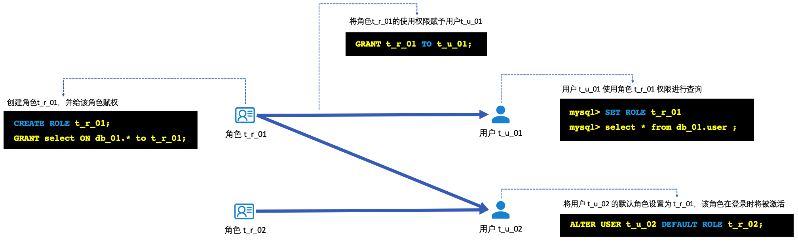

## 全面了解MySQL 8.0的“角色”：基础使用、底层实现和一些要避开的“坑”

Oracle对MySQL5.7的扩展支持到2023年10月就结束了，之后可能不再发布新的版本，是时候更多的了解MySQL 8.0了。同时，再看看各个云厂商对于用户和角色的支持情况。

从8.0开始，MySQL开始支持“角色”，帮助用户更好的进行权限管理，使用角色功能，可以批量、规模化的管理用户的权限。如果，需要较大规模新建用户，并对其权限进行管理的时候，这个功能将大大简化权限增加、减少时候的管理工作。

另外，在8.0版本中，MySQL对角色的设计上，非常的“偷懒”，因此，还有很多的隐藏的打开方式，附带的也留下了一些坑需要注意。

### 基础使用示例

基础的：

* "角色"是代表"一组权限"（例如，某个数据库的读权限、写权限等）的对象，可以将角色赋予某个用户后，该用户使用该角色运行时，则具备这"一组权限"。
* 当角色的权限发生变化（例如，收回或者新增权限）时，对应用户（使用该角色时）的权限也会跟着改变，这对于规模化的用户、权限管理是很方便的。

我们看看如下场景与示例：



1. 首先，创建角色t_r_01，并赋予其db_01的读权限；
2. 然后，将该角色赋予用户 t_u_01；
3. 这时，用户t_u_01就可以通过命令`set role...`使用t_r_01具备的权限
4. 另外，也可以像t_u_02一样，将t_r_02设置为其默认角色，则时候，该用户登录时，就自动具备了该角色对应的权限了

对应命令如下：

```sql
mysql> CREATE ROLE t_r_01;
mysql> GRANT select ON db_01.* to t_r_01;

mysql> GRANT t_r_01 TO t_u_01;

% mysql -ut_u_01 -p -hxxx
> set role t_r_01;
> select * from db_01.user;
```

如上就是一个典型的用户和角色的使用场景和主要的命令。那么再看看一些“不典型”的情况吧。

### 角色底层实现和一些“坑”

在前面，我们看到一个普通的用户和角色，是怎么建立，以及如何利用这个角色实现批量对用户的权限进行管理。这里，我们来看看MySQL对角色的底层实现以及留下的一些“坑”。

从MySQL的元数据上，观察到，在底层：**角色就是一个特殊的"用户"，一个没有密码的、被锁定的特殊用户**。在上下文中，主要使用角色名来引用角色。

```she
mysql> CREATE ROLE t_r_01;
Query OK, 0 rows affected (0.02 sec)

mysql> SELECT * FROM mysql.user where user='t_r_01'\G
*************************** 1. row ***************************
                    Host: %
                    User: t_r_01
             Select_priv: N
                     ......
          account_locked: Y
1 row in set (0.01 sec)
```

那么，这里就做几个大胆猜测：

* 对“角色”进行解锁操作后，就可以登录数据库，而且很可能不需要密码
* 任何的用户都可以当做一个角色，将这个用户权限赋予其他用户

这里先验证第一个猜想：解锁角色后，使用其免密登录数据库

```shell
# "t_r_2" 是一个测试角色，默认情况下是无法登录
zzx@192 ~ % mysql -hxxx.mysql.rds.aliyuncs.com -u t_r_2
ERROR 3118 (HY000): Access denied for user 't_r_2'@'1.1.1.1'. Account is locked.

# 使用另一个账号，对角色 "t_r_2" 进行解锁操作
zzx@192 ~ % mysql -hxxx.mysql.rds.aliyuncs.com -uroot -p
mysql> alter user t_r_2 ACCOUNT UNLOCK;
Query OK, 0 rows affected (0.01 sec)

mysql> ^DBye

# 解锁后，再用角色和空密码尝试登录
# ！！！！ 是的，登录成功了
zzx@192 ~ % mysql -hxxx.mysql.rds.aliyuncs.com -ut_r_2
Welcome to the MySQL monitor.  Commands end with ; or \g.
...
Type 'help;' or '\h' for help. Type '\c' to clear the current input statement.

mysql>
```

！！！是的，可以成功登录。

再次验证第二个猜想：任何用户都可以当做角色来赋权其他用户

```shell
mysql> create user t_u_1 identified by 'somepass';
mysql> grant select on db_1.* to t_u_1;
mysql> create user t_u_2 identified by 'somepass';

# 将用户当做角色，将其赋权给另一个用户
mysql> grant t_u_1 to t_u_2;
Query OK, 0 rows affected (0.00 sec)
# ！！！！ 是的，可以像这样赋权！！！
```

MySQL使用系统表mysql.role_edges保存角色与用户之间的映射，我们也可以看到，如上的赋权信息：

```shell
mysql> desc mysql.role_edges;
+-------------------+---------------+------+-----+---------+-------+
| Field             | Type          | Null | Key | Default | Extra |
+-------------------+---------------+------+-----+---------+-------+
| FROM_HOST         | char(255)     | NO   | PRI |         |       |
| FROM_USER         | char(32)      | NO   | PRI |         |       |
| TO_HOST           | char(255)     | NO   | PRI |         |       |
| TO_USER           | char(32)      | NO   | PRI |         |       |
| WITH_ADMIN_OPTION | enum('N','Y') | NO   |     | N       |       |
+-------------------+---------------+------+-----+---------+-------+
5 rows in set (0.00 sec)

mysql> select * from mysql.role_edges;
+-----------+-----------+---------+---------+-------------------+
| FROM_HOST | FROM_USER | TO_HOST | TO_USER | WITH_ADMIN_OPTION |
+-----------+-----------+---------+---------+-------------------+
| %         | bekind    | %       | t_u     | N                 |
| %         | t_r       | %       | t_u     | N                 |
| %         | t_u_1     | %       | t_u_2   | N                 |
+-----------+-----------+---------+---------+-------------------+
3 rows in set (0.00 sec)
```

其实还有第三个猜想，就是具备CREATE USER权限的就可以创建角色，当然后面再文档中也看到了这个描述，这也进一步佐证了角色和用户的特殊关系，这里也不再单独验证了。

### 安全问题

角色的管理（将某个角色权限赋予其他用户）需要ROLE_ADMIN权限，如果用户具备这个权限，根据上面的实践，这个用户就可以将任何其他用户（SYSTEM_USER例外）的权限赋予自己了，这可能会超出当初赋予ROLE_ADMIN的初衷：只是允许对角色和其角色与用户关系进行管理。

所以，在使用角色和ROLE_ADMIN权限的授权时需要特别注意（这大概也是很多云厂商在该权限的赋予上非常谨慎的原因，后面会看到）。

### 云厂商的支持

这里测试阿里云、腾讯云、华为云、AWS RDS和AWS Serverless v2（MySQL 8.0）以及阿里云PolarDB，看看他们的MySQL 8.0版本对于角色的支持情况。这里简述一下测试结果（主要是ROLE_ADMIN权限支持）：


腾讯云对外提供的管理员用户是root，是唯一支持role_admin权限的国内云厂商。AWS Aurora Serverless v2自身就使用角色来进行权限管理的，所以，对于初始化的管理员账户也是支持role_admin权限的。这里看看Aurora的管理员权限：

```shell
show grants for bekind;
+------------------------------------------------+
| Grants for bekind@%                            |
+------------------------------------------------+
| GRANT USAGE ON *.* TO `bekind`@`%`             |
| GRANT `rds_superuser_role`@`%` TO `bekind`@`%` |
+------------------------------------------------+
2 rows in set (0.14 sec)

show grants for `rds_superuser_role`@`%`\G
************ 1. row ************
Grants for rds_superuser_role@%: ...CREATE ROLE, DROP ROLE ON *.* 
************ 2. row ************
Grants for rds_superuser_role@%: ...ROLE_ADMIN,SESSION_VARIABLES_ADMIN 
************ 3. row ************
Grants for rds_superuser_role@%: GRANT `AWS_COMPREHEND_ACCESS`@`%`...
3 rows in set (0.14 sec)
```

### 其他

* 用户新增某个角色时，并不会立刻具备对应的权限，而是需要使用该角色时，才可具备对应的权限。
* 没有SHOW CREATE ROLE命令查看role的创建。但可以使用SHOW CREATE USER来查看ROLE的创建命令和SHOW GRANTS来查看对应的权限。
* 系统变量"mandatory_roles"会指定一些角色，系统中的任何用户都会默认具有这些角色，如果当用户使用（激活、扮演）该角色时，则具备对应的权限。
* 系统变量"activate_all_roles_on_login"，如果打开的话，则用户会自动具备所有角色的权限，否则需要显式的使用SET ROLE命令才能够具备对应权限。
* 这个功能，MariaDB在2013年GSoC项目开始探索该功能的实现，MySQL在8.0版本开始支持
* MySQL的实现，与PostgreSQL比较类似，角色与用户界限比较模糊
* 从MariaDB的文档中看到，其设计时，在系统表中使用了字段标记角色，这个设计就与MySQL是完全不同的，相信在使用上也会完全不同。这种系统表的设计，和SQL Server是有一些相似之处的。

### 参考

* [MySQL 8.0 Reference Manual  /  Using Roles](https://dev.mysql.com/doc/refman/8.0/en/roles.html)

* [MySQL 8.0 Reference Manual / Privileges Provided by MySQL](https://dev.mysql.com/doc/refman/8.0/en/privileges-provided.html)

* [Roles Overview @ Knowledge Base » MariaDB Server Documentation](https://mariadb.com/kb/en/roles_overview/)

* MySQL 5.7的扩展支持：Oracle Technology Products Oracle Lifetime Support Policy

  
