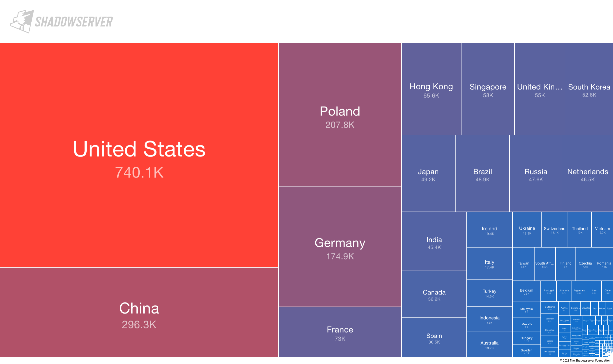

## 全网共有多少MySQL实例在运行？这里有一份数据

Shadowserver Foundation（[参考](https://www.shadowserver.org/)）在5月31日发布了一份全网的MySQL扫描报告，共发现了暴露在公网的360万的MySQL实例（[参考](https://www.shadowserver.org/news/over-3-6m-exposed-mysql-servers-on-ipv4-and-ipv6/)）。因为这份报告基数够大，而且信息也非常完整，从数据库专业的角度来看，里面是有很多非常有意思，且可以有一些非常量化的数据和结论的。之前网上的一些分析都是基于安全角度来分析，这里我们一起再看看这份报告里面隐含的一些数据库信息吧。

另外，这里的“暴露在公网”，是指其端口在公网可以被访问且响应握手信息，并不是可以被登录，并没有什么安全隐患。

### MySQL版本现状：8.0 GA已经四年，但5.7依旧是主流

以IPv4 Top 10的版本来看，当前5.7版本占比最大，其次为5.6和8.0版本。另外，MariaDB占比14%，更具体的：

* MySQL 8.0 GA日期为2018年04月，占比为8%
* MySQL 5.7 GA日期为2015年10月，占比为46.7%
* MySQL 5.6 GA日期为2013年02月，占比为30%
* MariaDB版本占比为14%，包括了MariaDB 5.5占比8.1%，其10.1版本占比6%

可以看到，MySQL 5.7依旧为当前最主流的版本，根据MySQL官方的规划，该版本可能在明年的10月就会停止对其的扩展支持，可能就不再更新版本。应该会有较大量的数据库将需要从5.7升级到8.0。于此同时，MySQL官方还可能会与今年推出新的大版本（可能是9.0或者8.1之类的），加上5.7的维护周期接近尾声，会较为大量的用户升级到新版本。

IPv6的版本的数据，与上面非常不一样。

### 全球共有800万MySQL实例在运行？

根据一些公开数据和部分经验数据，这里对全球MySQL运行实例个数做一个预测。

在这份报告中，共探测到约538万开放的3306端口，其中约360万返回了握手信息。那么，全球一共有多少MySQL在运行呢? 这里基于以下信息做一个猜测：

- 根据帕累托法则，即2/8原则，约仅有20%的因素影响80%的结果
- 诸如Google、Amazon、微软、阿里巴巴、腾讯、字节跳动等大型企业保有大量实例，且不可以被扫描
- 还会有大量实例运行在AWS、Azure、阿里云、GCP等云环境的VPC之中，如果没有开启公网IP，通常也无法被扫描到，这部分根据一些经验数据，预计为200万个
- 根据IDC数据，全球服务器2021年出货量为1350万台

那么，扫描到538万再加上200万，则有约738万个"闲散"实例。根据2/8原则，诸如Google、Amazon、阿里巴巴等这些大型企业(非云部分)中依旧可能保有着20%的实例（738万为80%部分），也就是约为184.5万个实例。那么预计：全球整体MySQL实例数量可能在922万这样的数量级。

另外，我们再从全球服务器出货量角度做一个验证。根据IDC数据，2021年全球服务器出货量约为1350万台，这里假设（该假设基于一些历史的经验）10台服务器对应一个数据库实例，那么2021年服务器出货量就对应了135万个实例，按照服务器平均5年折旧计算，总保有则约为675万个实例，这里与922万有一定的偏差。折中取这两个数据的平均值，所以这里预测：

**全球MySQL实例数在800万左右**

当然，这只是一个超大颗粒度的、不可验证的预测，如果有更好的预测模型或者数据支持，欢迎回复公众号讨论。

### MariaDB vs MySQL：MariaDB在一些细分市场份额很大

从这份数据来看，MariaDB是拿下了非常大的市场的。从IPv4 top 10版本统计信息来看，MariaDB占比为14.3%；如果，单从IPv6的统计数据来看，MariaDB占比为86.2%，实例数量超110万。

这里在IPv6环境中，部署量最大的版本为：5.5.5-10.5.12-mariadb-cll-lve，这是一个cPanel在Lightweight Virtual Environment的发行版本，而对应的MariaDB 10.5.12版本为2021年8月发布（[参考](https://mariadb.com/kb/en/mariadb-10512-release-notes/)）。从这个点看到，MariaDB是获得了更多的开源社区的信任，作为其发行版的默认数据库版本。甚至在一些细分的场景中，MariaDB甚至可以说可能成为了主流。

但根据在中国的实际感受来看，MariaDB的市场现状并没有以上数据展示的那么乐观，原因如下：

* 一是MySQL品牌依旧非常强大，虽然安装的MariaDB，但是实际使用的客户端依旧可能是mysql命令行，所以，用户依旧当做MySQL来使用。
* 另外，目前，大型企业全面使用MariaDB支撑核心业务的公司还比较少，大部分依旧是使用MySQL，并给予MySQL去进行优化，而不是MariaDB。

当然，从这个数据角度来看，MariaDB的这个部署量依旧会给其带来很多优势：

* 提升用户认知基础，虽然命令行依旧使用mysql，但是登录后依旧会看到MariaDB版本号信息和功能
* 产品会在各种环境中被使用，对其整体的稳定性会有较大的保障
* 相比MySQL，MariaDB已经获得更多Linux发行版的信任，这可能是进一步获得扩大市场的最重要的机会点之一

### 加密 or Not ?  49%的实例启用了TLS/SSL加密

从所有IPv4环境的实例数据来看，有49%启用了TLS/SSL加密。因为MySQL 5.7之后的版本，都已经默认开启了传输加密，这与前面的MySQL 5.7占比数据时基本吻合的，大部分用户在使用5.7或8.0的时候，都会使用其默认自带的加密能力。所以，你的实例开启了传输加密吗？延伸阅读：[开启TLS传输加密对数据库性能的影响](https://cloud-database-tech.github.io/database-tls-performance.html)。

### 全球分布：MySQL实例中国在全球占比15.8%

在这份报告中，从IPv4的数据中看到，中国MySQL实例数占比为15.8%（大陆地区约为13%，香港地区约为2.8%），仅次于美国的32.5%。其次是波兰、德国、法国、新加坡等地。另外，根据IDC的报告中国服务器出货量占全球比率约为25.3%（2021年，从销售额角度），所以，中国数据库的实际部署量可能更大。

### 从数据库看IPv4 vs IPv6

从整体数据来看，有反馈的扫描中，IPv4的3306共扫描到2,279,908个，IPv6共1,343,993个，在全球角度上，运行在IPv6上的MySQL已经达到了37%。但是，这个数据在中国，仅有0.1%。虽然，数据库部署并不适合作为IPv6和IPv4的对比，但作为一个参考，可以看到在全球范围IPv6已经比较高了，但是在中国普及率还非常低。

从这份数据来看，IPv6较高的国家有：美国、荷兰、新加坡、德国、英国等。

### 报告的限制

* 因为报告是通过端口扫描获得的信息，所以各个大公司自己内部的服务器都是不在其中的。所以，实际MySQL装机量应该远大于这个量。另外，大公司企业数据库情况可能与报告有一定的偏差。例如，通常大公司环境中数据库版本会比较统一，而不会简单的使用最新版本。
* 报告中的数据可以看到MariaDB的部署量比想象的要大。猜测的原因可能是，很多Linux发行版本中自带的仓库使用的是MariaDB数据库，这让MariaDB的装机量比想象的更大。
* 另外，报告没有公布所有的数据，例如版本数据，只有Top 10的版本，占整体IPv4的比率约为26%，还不是一个完整的数据，可能与整体数据会有一些偏差

### 其他

* MariaDB的握手阶段提供的版本信息与实例中的信息有一些不同，所以会呈现出比较多的是"5.5.5-10.5.12-mariadb-cll-lve"这样的版本号，其中10.5.12才是MariaDB正确的版本号；"cll"应该是代表有cPanel编译提供的发行版([参考](https://forums.cpanel.net/threads/is-cll-in-the-mysql-version-string-related-to-cloudlinux.351391/))；"lve"则可能是"Lightweight Virtual Environment"的缩写。
* [参考](http://plcscan.org/blog/2020/04/research-report-of-renowned-internet-census-organization-1/)：“Shadowserver是全球领先的恶意活动调查、互联网安全报告的公益组织，Shadowserver维护着世界上最大的安全信息存储库之一，它存储了数以万亿计的历史恶意网络连接，同时Shadowserver每天扫描整个互联网超过50种协议暴露情况，用于查找可能用于攻击利用的配置错误或存在恶意行为的系统，Shadowserver拥有超过20个监测节点。”
* Shadowserver还扫描了MongoDB、Redis、SQL Server的情况。MongoDB约为10万个（101338，[参考](https://scan.shadowserver.org/mongodb/stats/)）、Redis约为2.5万（[参考](https://scan.shadowserver.org/redis/stats/)）、SQL Server约为8.5万（[参考](https://scan.shadowserver.org/mssql/stats/)）。如果说，MySQL在很多Linux环境中可能默认安装，但是这几个数据库一般是不会被默认安装的。
* 报告中IPv6协议下的MySQL实例数据与实际感受差距非常大，例如在IPv6版本下，MariaDB占比约为85%（超100万实例）。在IPv6实例最多的国家是美国、荷兰、新加坡等来看，这与服务器出货量相关数据匹配度非常低。所以，有几种可能：一个是MariaDB在某个细分的场景下有非常大的优势，在早期对IPv6支持更好，所以在某些对IPv6有强制要求的地区和国家有更好的市场。
* 再次声明这里的“暴露”在公网，并不是说这些实例不安全，因为这里的探测不能，也没有连接上数据库，而是在连接之前的握手数据交换阶段。

### 链接 

Over 3.6 million exposed MySQL servers on IPv4 and IPv6 https://www.shadowserver.org/news/over-3-6m-exposed-mysql-servers-on-ipv4-and-ipv6/ 

