# 云厂商 RDS MySQL 怎么选

## 1. 摘要

为了让大家更好的了解各云厂商在RDS MySQL数据库功能上的差异，也为给准备上云的同学做个参考，本文将对**阿里云、腾讯云、华为云和AWS** 的 RDS MySQL数据库进行对比说明。

从一个数据库运维者的角度来看，如果要上云，需要关注的数据库指标有：基础资源、架构、功能、安全、性能、价格等各方面，本文就针对这些（除性能外）展开说明。

**说明**：本文有一定的时效性，内容基于各云厂商四月份的数据。价格、功能变化比较快，可能看到文章的时候，和写文章的时候某些结论已经有所不同。

## 2. 对比结果

从本文中的「**对比说明**」里的各个结论中能得到如下**结果**（只针对功能，暂不包含性能指标）：

*说明：5星制，按照本文后面的对比说明进行评分，规则比较简单：最好5星，其次4星，依次评分。*

**结论**

在国内，从服务的稳定性、可用性、监控、安全、备份恢复等功能的丰富度来选择的话，推荐阿里云；从服务的性价比，并在各个方面都有比较好的支持的情况下，推荐腾讯云。

在国外，从区域的分布数量，并在各个方面都有很好支持的情况下，如果不考虑价格，推荐AWS（大部分情况会高出国内厂商30%左右）；在国内云厂商中，阿里云和腾讯云在海外的区域都支持的不错，阿里云支持的实例规格最全，腾讯云性价比最好，如果在国内厂商中选择（海外业务），阿里云和腾讯云都可以考虑，根据实际情况选择。

## 3. 对比说明

* 以一个指标一个结论的方式进行说明，最后汇总各个指标的结论做出总结和评分。

* 对比对象为阿里云、腾讯云、华为云、AWS。

* 对比指标：从基础资源、架构、规格、安全、功能、计费、可用性等方面进行对比说明，来了解各云厂商在 RDS MySQL上的差异。

## 4. 详细对比

### 4.1 地域分布

与地域相关的概念包括了地区、可用区，这里说明如下：

* 地区（Regions）：云服务器所在数据中心的地理位置，如华东1（杭州）、华北2（北京）。
* 可用区（Availability Zones）：同一地区下电力和网络相互独立的区域，如杭州可用区H、杭州可用区G。

先看看主要厂商在地区 & 可用区上的支持情况：

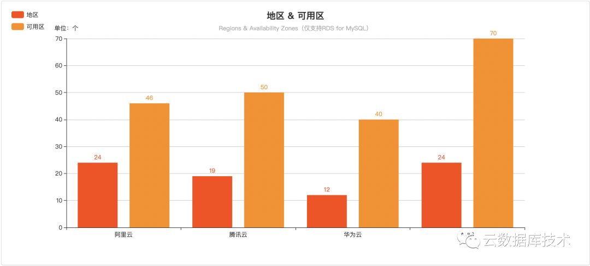

图中所示的是各云厂商在支持RDS MySQL服务的地区和可用区数量，具体看下面表格说明。

支持 RDS MySQL 服务的地区：

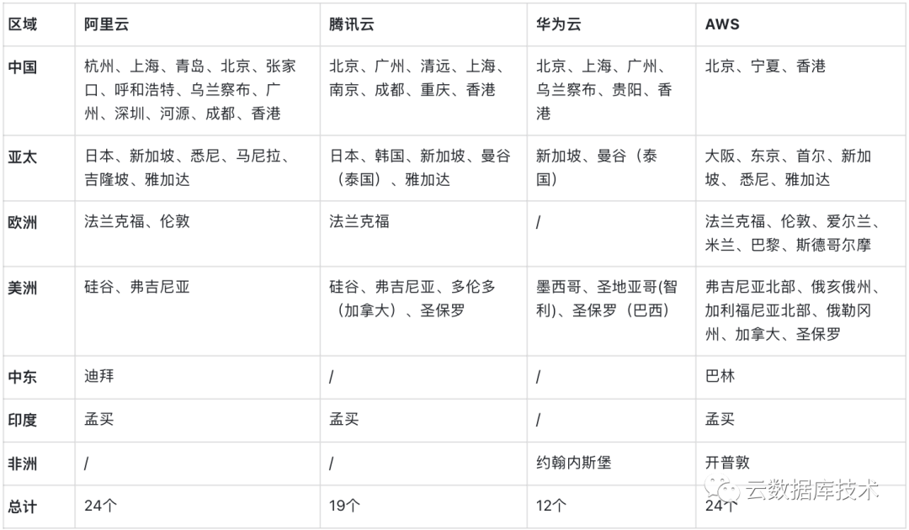

支持 RDS MySQL 服务的可用区数：

**结论**

在国内，地区数方面：阿里云最多，其次是腾讯云和华为云。阿里云是华为云的2倍，是腾讯云的1.5倍；可用区数方面：腾讯云最多，其次是阿里云和华为云，腾讯云是阿里云的1.08倍，是华为云的1.25倍。

在国外，地区和可用区数：AWS最多，华为云最少，其次是阿里云和腾讯云。华为云在欧洲目前没有自营的数据中心，如果有海外业务，需要考虑云厂商在海外地区的分布情况。

### 4.2 实例属性

架构&规格

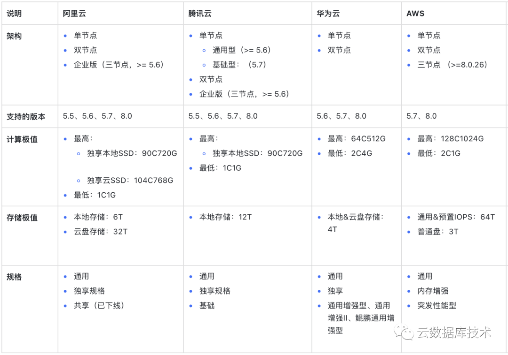

**结论**

在架构上，阿里云、腾讯云、AWS都支持三节点（1主2备），华为云不支持；其中AWS三节点中的备节点，可以提供读服务，具体可以看 [三节点形态，哪些业务场景应该选择](https://mp.weixin.qq.com/s?__biz=MzkxODMzMjk1Ng==&mid=2247483682&idx=1&sn=0854dd462014112da5f431b835b92737&scene=21#wechat_redirect) 文章的说明。

在计算规格和存储空间上，AWS支持的最高，其存储空间可以扩展到64T，其次是阿里云，存储空间可以扩展到32T，华为云不管是云盘还是本地盘，最高扩展到4T。

RDS MySQL 在本地盘能达到最好的性能，如果对本地盘空间有比较大的要求，则可以选择本地盘更大的厂商。

### 4.3 计费

计费方式

额外计费项：已购买包年包月的实例，还会产生费用，因为还有额外的一些付费项

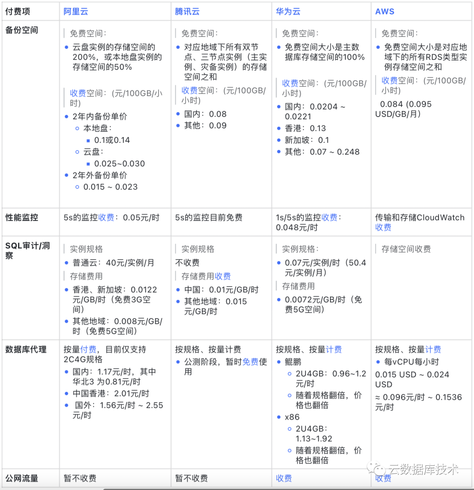

**结论**

计费方式上，各云厂商的计费方式都是按需付费和预付费，AWS在预付费(不支持包月，支持包年，时间为1年或3年）的基础上还设置了3种模式：无需预付费用、预付部分费用、预付全费，来获得不同程度的折扣【折扣只包含实例规格，不包含存储和IOPS】。另外，AWS还根据预分配IOPS进行来收费。

额外计费上

- 备份空间：在国内，阿里云价格最高；在香港和国外，华为云价格最高；
- 性能监控：阿里云比华为云高4.2%，华为云和AWS可以支持到最小1s的粒度，其他的最小粒度为5s，腾讯云目前免费；
- SQL审计：腾讯云只收存储费用，阿里云和华为云收实例费用和存储费用，存储上腾讯云价格最高，比阿里云高25%，比华为云高39%；
- 代理：阿里云的规格不能调整，目前仅支持2C4G规格，并且腾讯云在数据库代理方面处于免费阶段，AWS价格最高；

### 4.4 安全

网络、权鉴、加密、监控、容灾方面

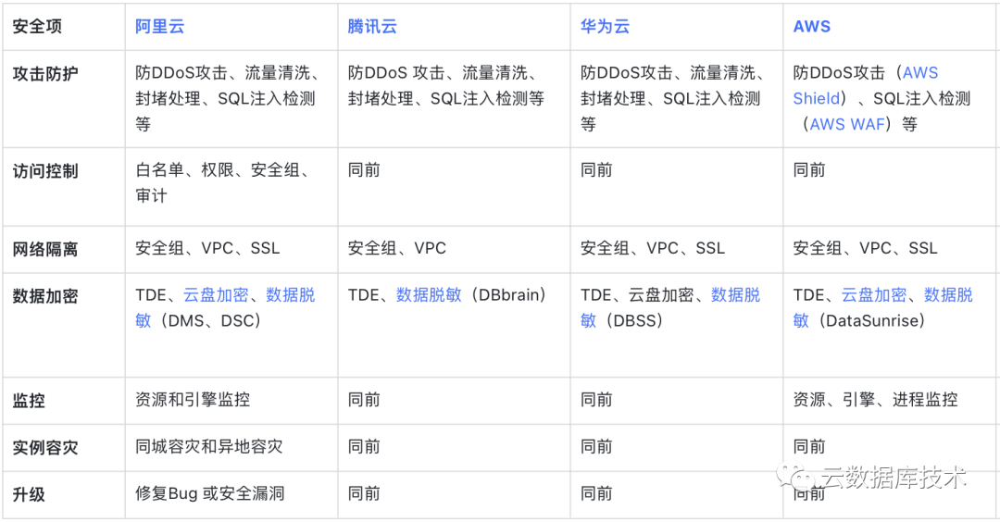

**结论**

各个云厂商在安全方面的支持度差距不大，腾讯云目前还没有支持SSL加密。

### 4.5 功能

#### 监控、告警

###### 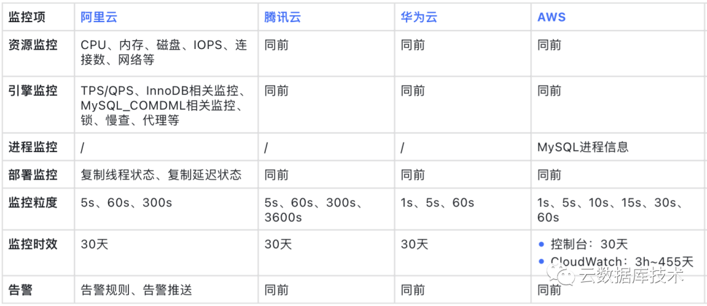

#### 日志&审计

#### 备份&恢复

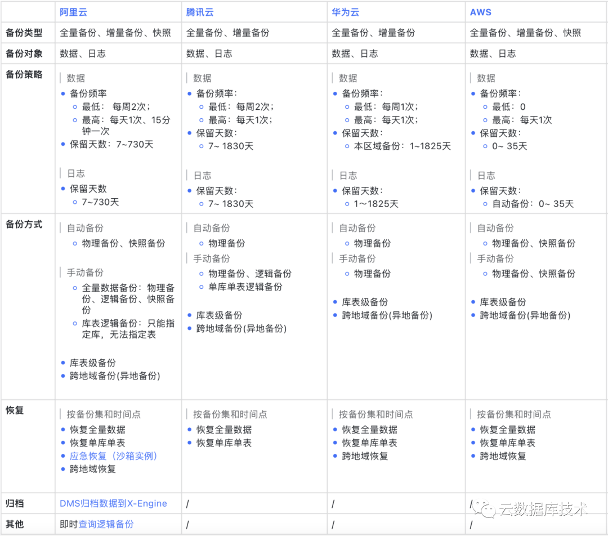

#### 数据库代理

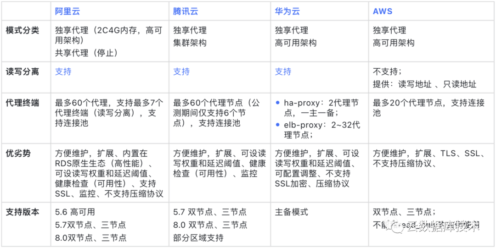 

**结论**

在监控和告警上，各云厂商支持的类似；AWS可以直接监控MySQL的进程信息，如虚拟内存、物理内存、CPU使用； 监控粒度上，华为云和AWS可以支持1s/次的粒度，其他厂商为5s/次。

 在日志和审计上，各云厂商都支持SQL审计/洞察，腾讯云分同步和异步审计，AWS的审计基于MariaDB的审计插件；阿里云的审计日志对性能影响极低（具体没说明），腾讯云异步影响3%、同步影响6%左右，华为云影响10%左右。

在备份和恢复上，各云厂商都支持了全量、增量的备份和基于时间点的恢复功能（华为云不对逻辑逻辑备份进行支持）；阿里云还支持了对数据进行压缩归档和直接查询备份集的功能，以及提供了快速的应急恢复的能力，提供分钟级的RTO或RPO能力，可用于在线数据的即时恢复。 

在数据库代理上，国内各云厂商都支持了自动读写分离，只读节点提供读服务；其中阿里云的代理规格是固定的，其他的可以选择不同的规格；AWS的代理在MySQL上没有支持自动读写分离，提供了只读和读写IP。腾讯云目前没有对SSL加密进行支持。

### 4.6 服务等级

可用性

**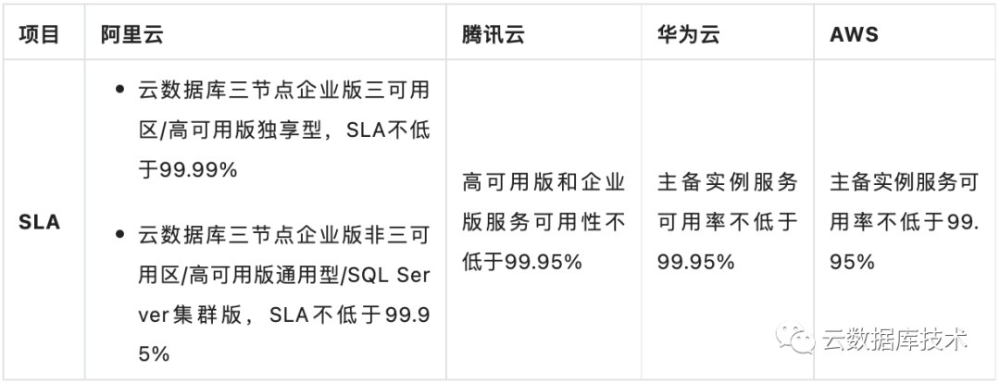**

**结论**

阿里云的独享实例类型在SLA上最高，保证了至少99.99%，其他云厂商都是99.95%。

### 4.7 示例费用

为了更好、更直观的了解实例消费的情况，在指定同一个地域的前提下，对常用的MySQL规格进行比较说明。

实例规格

****

实例费用

国内：区域上海，针对独享型、本地SSD规格进行比较

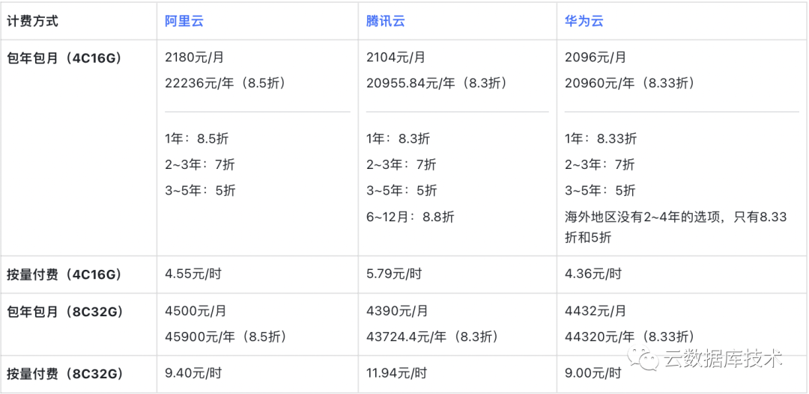

海外：区域新加坡，腾讯云在海外节点上只支持通用型和本地SSD，华为云只支持云SSD，所以针对通用型、本地、云SSD规格进行比较

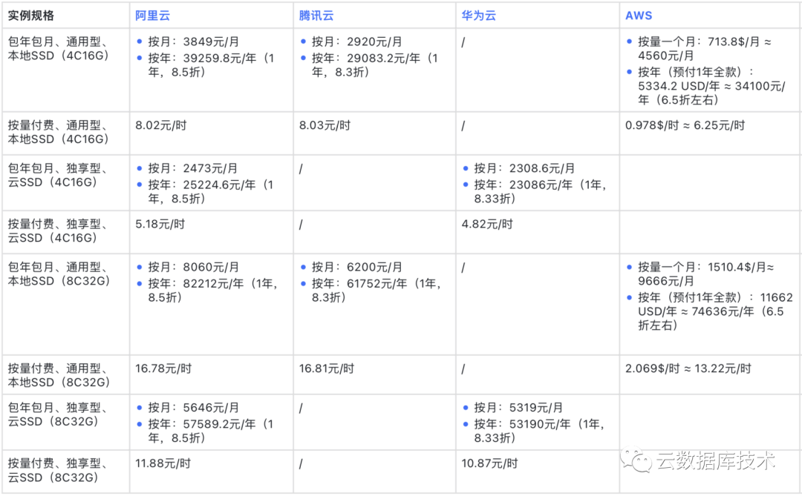

**结论**

国内（上海）中，以上2个规格的实例，在包年包月上价格上差距不大，阿里云和腾讯云差距在2%~5%，和华为云差距在1%~4%；腾讯云在按量付费上有三阶梯计费规则；

国外（新加坡）中，以上2个规格的实例，阿里云价格最高，但在规格上支持的最多，腾讯云不支持独享型规格，华为云不支持本地SSD规格。同规格下阿里云比腾讯云高20%~30%，比华为云高5~10%。

和AWS（通用型SSD gp2）比（**新加坡地区**）

- 按需付费模式的按时：AWS比国内云厂商本地盘规格的实例价格低25%~30%，比云盘规格的实例价格高20%~30%。
- 按需付费模式的按月：因为AWS没有包月模式，所以按需的月价比「阿里云-本地规格」高18%左右，比「腾讯云本地盘规格」高56%左右；比「阿里云云盘规格」高84%左右，比「华为云云盘规格」高97%左右。
- 预付费模式（预付1年全额）
  - AWS的费用比阿里云（本地盘规格）低10% ~ 15%，比腾讯云（本地盘规格）高17%~21%。
  - AWS的费用比阿里云的（云盘规格）高30%~35%；比华为云（云盘规格）高40%~47%。

### 4.8 对比小结

- 国内云厂商中，在常用的规格下（4c16g、8c32g），阿里云比腾讯云高2%~5%，比华为云高1%~4%。

- 海外（新加坡）区域，AWS在预留付费1年（全额）下
  - 国内厂商中，同规格下阿里云比腾讯云高20%~30%，比华为云高5~10%。
  - 云盘规格下，AWS价格比阿里云高出20% ~ 35% 。
  - 本地盘规格下，阿里云的实例价格高于AWS（**新加坡区域**，有些区域不是，但该规格下和AWS价格差距不大，具体看购买页价格），但总比腾讯云和华为云高。

## 5. 总结

通过各云厂商的对比，得出本文开头部分「**对比结果**」中的结果和评分。希望通过阅读本文，对大家在选择云厂商的RDS MySQL产品时有帮助。

## 参考文档

* https://help.aliyun.com/document_detail/26092.html
* https://cloud.tencent.com/document/product/236/5146
* https://support.huaweicloud.com/rds/index.html#tabpane_06314173
* https://docs.aws.amazon.com/zh_cn/AmazonRDS/latest/UserGuide/Welcome.html