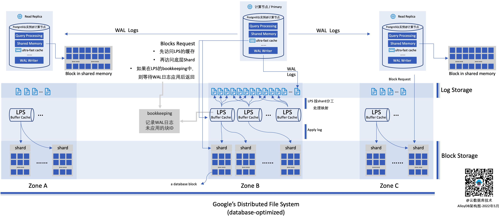

深度解析Google云新数据库产品AlloyDB

在上周的Google I/O大会上，GCP（Google云平台）正式对外发布了数据库AlloyDB（Preview版本）。因为一直比较关注云原生数据库架构与技术的发展，所以，这里对AlloyDB的架构也做一个较为深入的分析，看看与当前的云原生数据库PolarDB、Aurora有哪些异同。

### 概述

AlloyDB是GPC上的一个全托管的云数据库服务，当前完全兼容PostgreSQL 14，提供企业级的性能、扩展性与可用性。声称是标准PostgreSQL性能的4倍，AWS同类服务的两倍（应该是指RDS PostgreSQL和Aurora PostgreSQL），如果是分析查询，则可能有100倍的性能加速。另外，在介绍时，还特别提到，价格非常透明，这应该是针对当前AWS数据库大多数都对IOPS独立并按量计费而说的。

### 整体架构图

根据当前资料，其整体架构如下：

### AlloyDB与Aurora、PolarDB有什么异同

* 简单来说，其架构与现有的云原生数据库Aurora、PolarDB都非常相似。使用了存储计算分离，分布式存储提供了多节点挂载能力。分布式存储，会带来海量存储能力，以及非常强的IO吞吐能力；多点挂载，大大增强了数据库的读扩展能力，同时因为底层使用同一个存储，所以也不再有数据拷贝和延迟等问题。
* 在实现上，体现了"the log is the database"，尽可能只传输日志，避免数据块的传输与复制。例如，计算节点与存储节点的不再传输数据块（当然，就多了一个日志应用的过程）。这一点与Aurora类似，但是PolarDB在日志下推上，做得比较少，而是选择将存储以"较为标准"的文件系统提供给计算节点，数据库本身的各个模块还是比较完整的，这带来的好处是，对数据库的侵入要稍微小一些，对于新版本的支持和不同的数据库的支持会更加简单和一致。Aurora和AlloyDB的这种做法，则是将数据库的解构更加彻底，将数据库的日志模块一定程度下沉到存储层。在AlloyDB在实现时，还将这个部分彻底的做了分布式，通过多个不同的日志处理进程（LPS）进行分布式并发处理。
* 这种日志处理的下推，也让数据库在进行崩溃恢复的时候，相比传统的一体化架构要快非常多，也就让数据库所提供的SLA可以更高。因为没有checkpoint，也应该就没有什么fuzzy或者sharp一说了，后端的LPS进程会持续的将redo apply到本地存储，分布式存储上的数据块的版本总是非常新的。而不用像传统数据库，数据库crash后，所有的没有刷写到磁盘的脏数据块（内存中该数据库已经更新，但是还没有刷写到磁盘）都需要通过redo应用到最新状态，所以，传统数据库在崩溃恢复时总是需要一定的时间，而且内存越大，这个时间可能会越长。
* 另外，AlloyDB的日志存储使用了较为独立的存储，也就是文中提到了"log storage"或者"log store"。考虑日志与数据块的读写特性都不相同，使用独立的存储在性能优化上，会更加有效。一般来说，日志写入通常是append-only的，而且是"同步"操作，需要非常低的延迟，另外，在AlloyDB的设计中，日志写入后，需要立刻读取并应用到数据块中。只需要将内存中已经更新过的数据块覆盖写入本地存储就可以了。而数据块的处理，通常来说是一个异步的过程（不阻塞数据库的写入），并且会有大量的随机读，这与日志数据的访问有很大的不同。这里的一个猜测是，日志存储和数据块存储可能使用同一套存储架构，但是可能使用面向不同场景的优化和参数，如果有Google的人，希望求证一下。
* 计算节点使用了"ultra-fast cache"，猜测一下，可能是使用了与PolarDB类似的optane存储作为加速，虽然使用optane卡的场景不同。这也是另一个希望求证的点。
* AlloyDB的数据块请求是带有LSN号的，而每个可用区（Zone）内都有完整的数据块，所以，在各个可用区的节点（可能是read replica）总是可以在本地可用区获得最新的数据块。也就是无需像Aurora使用的多数派协议，数据块的读取需要3份（写入四份，4+3>6），当然Aurora也对这里做了很多的优化（例如，通过一个bookkeeping记录写入数据和node的对应关系，尽可能将多数派读取变成一次单节点的读取[[参考](https://aws.amazon.com/blogs/database/amazon-aurora-under-the-hood-quorum-reads-and-mutating-state/)]）。
* AlloyDB下沉到存储的日志处理服务（LPS），也做了彻底的分布式。日志存储在一个底层的相对独立的日志存储中，日志处理服务则是一个分布式的、相对"无状态"的进程，因为也做了存算分离，所以有非常好的扩展性。另外，在日志处理的分片上，AlloyDB通过将底层的数据块分成一个个独立的分片（Shard，应该类似于PolarDB或其他系统中的chunk），每个分片由一个独立的LPS处理，一个LPS可以根据系统压力情况处理一个或多个分片。这样就通过分布式的方式解决了日志应用的问题。并且，这个日志应用是在各个不同的可用区独立运行。
* 关于数据副本数量的问题：Aurora是3*2的副本设计，每个可用区两个副本，每次写入应该是3个副本，读取可能需要4个副本，这种性能应该比较差，达到的效果是宣传"AZ+1"的容灾能力，也就是一个可用区失败，再加一个副本失败，依旧可以恢复数据。在实现上，Aurora对于底层副本感知是要更强的，并与上层实现结合起来了。但是AlloyDB使用Google底层统一的存储，这里看到的数据分布在三个zone，有三个副本，但实际上，每个zone的数据是存储在一个分布式存储的，这个分布式存储数据的副本数情况，并没有对数据库暴露。这里可以猜测，可能是两个副本或者更多，对于数据库这里IO敏感型的应用，应该比较难使用EC算法去做去重。所以，实际上，一份数据，可能会有超过6份的副本数。
* 另外，这里看到，Block storage部分是可以通过一些智能化的方式，对数据块进行分级，降低整体的存储成本的，这应该是底层存储的数据分层能力。
* 注：无论是AlloyDB还是Aurora相对于PolarDB，其分布式都更加彻底，PolarDB由于使用了RDMA网络去加速跨节点日志、数据同步的性能，这也使得其跨可用区容灾没有做到RPO为0。AlloyDB和Aurora在这个问题上，都是使用了更简单的逻辑，在保障可接受的延迟的情况下，保障整体的吞吐量的扩展性，这也是分布式的底层价值之一。而这一点上，PolarDB则更像一个更传统的RACK。

### 写操作

这里通过一个写操作来看看，AlloyDB的整个处理流程。客户端通过TCP连接，连接到主实例，然后将变更SQL发送到主实例。主节点进行SQL解析、并在内容中更新数和索引页，同时，准备好WAL日志。在事务提交时，则同步地将日志写入低延迟的日志存储，这些日志则会被日志处理进程（LPS）异步的消费并处理。

存储层被分成了三个部分：日志存储、日志处理服务、数据块存储。日志存储本身是顺序写，并对写入延迟要求很高，会直接影响事务处理的性能。AlloyDB专门针对该模式/场景进行了优化，以提供一个高性能的、低延迟的日志存储服务。

多个日志处理服务（LPS）则会根据"Shard"（一组数据库的数据块）机制，对不同的日志进行处理。先从存储层读取需要处理的数据块（随机读），然后将redo日志应用到这些数据块，并回写（持久化）数据块到存储中，并最终删除日志存储中的日志记录。

### 读操作

读操作有两种情况，一个是从主节点提供服务，一个是从读节点（read replica）提供服务。如果查询所需要的数据都在内存中，那么就和单机的PostgreSQL实例一样，进行SQL解析、执行计划生成、查询执行，并响应用户。为了加速查询处理，AlloyDB在数据库中额外集成了一个"ultra-fast block cache"。

如果，需要的数据块在上面的两级缓存中都不存在，则需要到存储中获取。在把请求发送给存储层的时候，需要附带把LSN（log-sequence number）号也作为请求的一部分，而底层存储则返回满足该LSN对应事务能够看到数据块。

从整体存储层来看，LPS进程也会参与数据块的请求的处理。LPS进程也有自己的缓存，如果请求的数据块在这个缓存中，则会立刻返回给上层节点。如果，这里再次缓存缺失，则再向数据块存储读取数据块并响应请求。

这里，LPS进程需要存储一个"列表"，用于记录日志已经提交，但是，还没有应用到底层的块记录。对于此类数据块的请求，则需要先完成日志应用再返回。虽然，此类情况不应该经常出现，因为如果是一个最近日志没有应用的块，缓存应该不太会把这样的页面清除。

### 其他

* 虽然是Preview，但已经是目前看到的最具诚意的Preview了：任何用户立刻就可以开通使用，并且给予了非常大的免费额度，具体的，计算节点每月免费不超过1.5万美元、存储节点不超过650美元的资源。
* 另外，注意到，GCP会说这是一个"fully-managed, PostgreSQL-compatible database"，而不会过多的强调这是一个云原生的数据库系统。对于用户来说，这就是一个具备高性能、高可用以及高可靠的PostgreSQL。至于，是不是Cloud-Native的，Google似乎对于这个概念并不那么"感冒"。
* 通过实现"non-disruptive instance resizing"、Vacuum优化管理、Crash Recovery的速度提升，这个服务推出就是99.99%的SLA。
* 更底层使用的是Google内部统一的分布式存储层，经过Gmail、Youtube等大型系统的验证，性能/稳定性等经过了验证。这一点上，AlloyDB与PolarDB、Aurora是不一样的。PolarDB和Aurora都选择了实现自己面向数据库的分布式存储系统，而AlloyDB选择了更加通用的存储层，再面向数据库进行优化。这两个路线，客户价值都是直接的，但哪个方案的生命力会更加持久，可能需要几十年的时间去观察。
* 与AlloyDB一起，GCP还推出一个Oracle到PostgreSQL的迁移服务，只是这个服务看起来推出的也比较仓促，比较困难的结构迁移部分，使用了一个第三方的开源产品来实现。一方面可以看到这个，迁移是非常重要的模块，另一方面也看到，这一块做起来其实比较难。从这里看到，AlloyDB考虑优先推出PostgreSQL版本的一个重要原因，是认为：Oracle数据库的迁移至关重要，且PostgreSQL是Oracle迁移的重要目标数据库。
* 目前，发布的内容来看，关于数据库内部的并发访问/多版本管理的内容比较少，这部分应该是另一个复杂的点。期待后续的文章。

### 一些明确的不确定的点

* ultra-fast cache是什么介质？ 如何被使用？
* 对于其他zone（非primary节点所在的zone），他的WAL日志（在log storage上）从哪里获取？ WAL一定是具备跨zone的容灾能力的，这里WAL的容灾是在数据层去做的（日志写时写两份或者三份），还是log storage去做的？
* 与上面的问题相关的另一个重要的问题，LPS进程是全局的还是属于某个Zone的？
* log storage是针对日志场景专门进行优化的，其模式是，append-only、延迟敏感并直接影响效率，这里的疑问是，做了哪些优化？ 

如果有Google的同学，可以讨论一下。

### 参考

* [AlloyDB for PostgreSQL under the hood: Intelligent, database-aware storage](https://cloud.google.com/blog/products/databases/alloydb-for-postgresql-intelligent-scalable-storage) 
* [AlloyDB for PostgreSQL](https://cloud.google.com/alloydb) 
* [Introducing AlloyDB for PostgreSQL: Free yourself from expensive, legacy databases](https://cloud.google.com/blog/products/databases/introducing-alloydb-for-postgresql)
